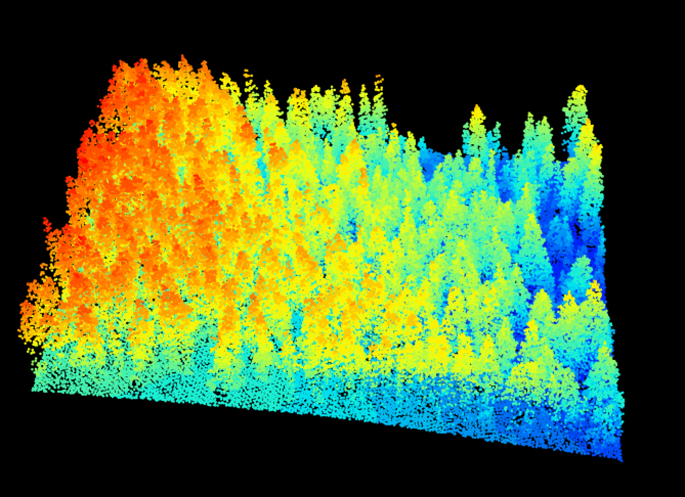
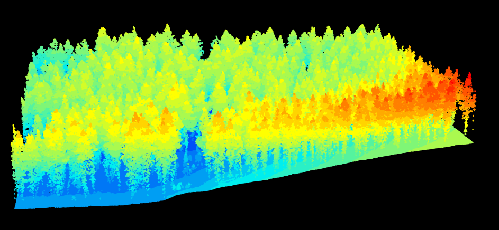

# Abstract
Forests are the predominant and most biologically diverse terrestrial ecosystem. They provide a range of ecosystem functions and support environmental processes including the global hydrological cycle, carbon sequestration, and resilience to climate change. Montane ecosystems are unique as they have an inherent topographic relationship which influences their structure and species composition. In this study, forest structure is evaluated using field data collected at 73 study sites across Bighorn National Forest, Wyoming. This was paired with remotely sensed LiDAR data to obtain tree heights and with elevation data to infer topographic information. Linear models were constructed and used to analyze data which was found to be normally and lognormally distributed. This study found that elevation and topographic position at a 100-meter resolution were the most common explanatory factors after accounting for forest type.  Topography could explain between 1- 30 percent of the variability of forest structure. In Bighorn National Forest, both diversity and stand density were significantly positively correlated with elevation. This study suggests that the effects of topography on forest structure are significant and should be considered to help ecologists and scientists make stronger predictions on montane ecosystem function and diversity, and generate informed and effective management plans.

# Introduction
## Forests
Forests are the most diverse (Brockerhoff et al. 2017; Pan et al. 2018) and widespread terrestrial ecosystems on the planet. A forest is most often defined as covering a minimum of 0.05 hectares of land and having at least 10 percent tree canopy cover (Chazdon et al. 2016). In addition to providing habitats and resources, they provide a range of vital ecosystem services and functions including carbon storage, nutrient cycling, erosion control, water flow regulation, and support of global resilience to climate change (Coder 2011; Moon and Solomon 2019). Forests are generally categorized as temperate, tropical or boreal depending on their latitude and climatic conditions, and can be further subdivided based on elevation, altitude, climate, and species composition.
In the global hydrological cycle, forests control headwater and subsequent processes of evapotranspiration and infiltration (Mitchell et al. 2012; Kelly et al. 2016). In the Rocky Mountain Range watersheds are fed by seasonal snowmelt from higher elevations which provides water and nutrients to the forest ecosystem at the lower elevations (Westerling et al. 2006; Littell et al. 2008). The allocation of streamflow primarily relies on topographic elevation and slope angle, in addition to the soil content. Forests also influence floodplains, the water table, and groundwater levels, and act as riparian habitats (Black 1998; Kelly et al. 2016). Roots act as a natural stabilization mechanism on steep slopes reducing the possibility of soil erosion as well as flood events in forests (Preti and Giadrossich 2009; Preti 2013; Vergani and Graf 2016).

## Montane Forests
Montane forests are a biotic altitudinal zonal designation in a spectrum of elevation and slope angle (North et al. 2016; “Life Zones | Yosemite and Sequoia Field Stations”). They are found at altitudes ranging from under 500 to over 3000 meters, depending on factors of humidity, latitude, precipitation, slope aspect, soil moisture, and temperature (North et al. 2016). Montane forests consist of an Upper and Lower designation (Figure 1), dependent on latitude and elevation (Powell 1994).
    

At global and regional scales, biological composition is significantly influenced by topography (Homeier et al. 2010). Topography at finer, or more focused scales (less than 100-meter resolution, with ultra-fine at 10-meter or less) directly impacts land cover, land surface albedo, moisture, nutrient availability, soil composition, subsequent local temperature, weather patterns, and surface temperature (Hais and Kucera 2009; Guo et al. 2016; Broxton et al. 2020). Topography at a coarser resolution (greater than 100-meters, and commonly 1000-meters) has a more general influence on climate (Muscarella et al. 2020), fire regimes (Morgan et al. 2001), and forest hydrology (Tague and Band 2001; Vaze and Teng 2007). 


## Forest Structure
The structure of a forest is commonly described using biotic factors such as species composition, distribution, and diversity, stand density and age, tree height, as well as the functional traits such as canopy density, gap fraction, leaf area index, leaf angle, and diameter at breast height (DBH) (Smith 1992; Crookston and Stage 1999; Montgomery and Chazdon 2001; Kint et al. 2003; Kayitakire et al. 2006; Homeier et al. 2010; Mura 2015; Jucker et al. 2018; Fathia et al. 2019; Li et al. 2020; Walter et al. 2021), with consideration also given to photosynthetically active radiation (PAR) intercepted by the forest canopy in the stand (Sinclair and Knoerr 1982; Smith 1992; Montgomery and Chazdon 2001; Breda 2003; Banerjee et al.; Oker-Blom et al.). Forest structure is influenced predominantly by climate (Dubuis et al. 2013; Kayiranga et al. 2017; Muscarella et al. 2020), and correlations between forest structure and altitude have also been identified (Homeier et al. 2010; Jucker et al. 2018; Li et al. 2020). From an anthropogenic standpoint, forest structure is altered by land use conversion and subsequently, climate change (Zenner and Hibbs 2000). Understanding the factors that influence forest structure is imperative to understanding ecosystem function (Kint et al. 2003), and developing proper management techniques (Crookston and Stage 1999; Mura 2015; USDA Forest Service 2018; Moon and Solomon 2019).  

## Diversity gradients
Biodiverse landscapes with natural patterns of species richness generally follow the latitudinal diversity gradient, with most species on Earth being found within 60 degrees North of the equator, in temperate or tropical climates (Pianka 1966; Hillebrand 2004; Jones et al. 2008).  Biodiversity is high in environments that are ideal for life, with accessible resources, warm average temperatures and adequate precipitation. Coinciding with lines of latitude are temporal and climatic factors, which can generally be categorized as biomes (Kummu and Varis 2011). Within the latitudinal gradient, species composition and traits are uniquely influenced by elevation and altitudinal gradient (Homeier et al. 2010). The elevational diversity gradient offers a more specific record of biodiversity at a finer scale, than the latitudinal diversity gradient (Sanders and Rahbek 2012), and aggregate diversity and structure related to topographic gradient are comparable (Homeier et al. 2010). Understanding the conditions of biodiversity is important to the conservation and management of resources and ecosystem productivity, and global ecological resilience to climate change. 
 
## Topography
Topography relates to the geographic configuration and features of a surface (Moeslund et al. 2013; Merriam-Webster Dictionary 2021). It is most often characterized by a change in elevation, in relation to slope angle and slope aspect and can demonstrate the relative shape and size of a geographic feature. Elevation is measured by units in length above a datum, most frequently given as meters or feet above sea level, while slope angle is defined as the degree of change from a horizontal plane, and slope aspect relates to the direction the slope faces relative to Earth’s poles. On both coarse and fine scales, biotic compositions are significantly influenced by topography (Weiss 2001). Topography at finer scales directly influences soil composition, temperature, nutrient availability, and moisture, solar radiation and subsequently, local temperature and weather patterns. Topographic features can be classified using the topographic position index (TPI) which measures the elevation of a cell to its neighbors and splits landforms into the following categories based on relative slope position: valleys, lower slopes, flat, middle slopes, upper slopes, and ridges (Weiss 2001).   
 	Additional topographic variables include terrain ruggedness, and TPI or landform classification (Mukherjee et al. 2013; Fink and Jewell).  Elevation and elevational gradients influence the distribution of vegetative species as elevation is key to both temperature and precipitation, which in turn influence nutrient cycling (Guo et al. 2016; Matawa et al. 2016; Cairns 2021). Slope angle represents the degree of elevation of a landform and helps define landforms which impact forest hydrology as it influences snowpack, avalanches, runoff, erosion, and landslides (Enoki 2003; Overgaard et al. 2006; Ryan et al. 2015; Filoso et al. 2017). Slope aspect displays the slope’s position relative to the sun and influences the temperature, solar radiation, precipitation, and soil moisture in an environment (Kayiranga et al. 2017). In the Northern Hemisphere, southern and western aspects are warmer, and northern and eastern aspects have cooler temperatures (Wang et al. 2015; Kayiranga et al. 2017).  Generally speaking, a causal relationship between slope aspect and species distribution can be seen (Fialko et al. 2020). 

  
## Purpose
While a relationship between forest structure and altitude has been identified, further studies on the quantitative influence of alternate topographic variables is necessary. Investigating the structure of a montane forest as a function of topography will help ecologists and scientists make stronger predictions about ecosystem function and biodiversity in montane forests and generate informed and effective management plans. This study considers topography as an explanatory variable of forest structure and performs linear regressions to quantitatively analyze the effect of topography on forest structure. This study specifically asks the following questions:   
Q1) What is the effect of elevation on forest structure?   
Q1) What is the effect of elevation on forest structure?   
Q2) What is the effect of slope angle on forest structure?   
Q3) What is the effect of slope aspect on forest structure?   
Q3a) What is the effect of North-South aspect?   
Q3b) What is the effect of East-West aspect?   
Q4) What is the effect of TPI on forest structure?   
Q4a) What effect does a 10m resolution have on TPI?   
Q4b) What effect does a 100m resolution have on TPI?   
Q4c) What effect does a 1000m resolution have on TPI?   
Q5) What is the effect of TRI on forest structure?   
Q6) What is the effect of land-cover type on forest structure?   
## Hypotheses
H1. Forest structure is negatively correlated with increasing elevation.  
H2. Forest structure is negatively correlated with increasing slope angle.  
H3. Forest structure is negatively correlated with north and east aspects.   
H4. Forest structure is controlled/determined by topographic position index/ landform classifications.    
(forest structural homogeneity is positively correlated with increasing spatial resolution of the topographic position index)  
H5. Forest structure is negatively correlated with increasing Topographic Roughness.  
H6. Forest structure will be positively correlated with land cover and forest type.   

# Methods
## Study Area
The location chosen for this project is Bighorn National Forest in Wyoming, United States. Bighorn National Forest is approximately 128 kilometers long and 48 kilometers wide, encompassing over 404685 hectares of land (USDA Forest Service 2021). The elevation of Bighorn National Forest ranges from 1524 meters to its highest elevation of 4013 meters at Cloud Peak (USDA Forest Service 2021). Approximately 66% of Bighorn National Forest is forested and made up of Pseudotsuga menziesii,  Pinus contorta, and Picea engelmannii, Pinus flexilis, Pinus ponderosa, and Populus tremuloides (Witt 2008). The sites chosen for this study are located within the National Elevation Dataset N35 W108, as shown with the black outline in Figure 2, which is approximately 4828 square kilometers.


## Site Selection
From August 12-21, 2021, seventy-three plots at 10x10 meters were selected across the study area of Bighorn National Forest (Figure 3). 
[Plot Photos](https://photos.app.goo.gl/7zMj8sdf28nxAFVS6) 
The sites chosen were representative of the adjacent area, with their suitability primarily derived by their elevation to ensure they were within the montane biogeographic zone (between 1700 and 3000 meters). Elevations lower than 1700 meters, and greater than 3000 meters were derived from a 1/3 arc-second Digital Elevation Model (DEM) were contained in polygons and excluded from site selection consideration. The secondary consideration for site selection was given to the accessibility of the site. The majority of the sites chosen were 100 meters from a secondary road (dirt or gravel and not maintained), with few sites being greater than 100 meters from a primary road (paved and maintained). Topographic and geographic features were also included in the analysis of site accessibility, with steep inclines or declines, cliffs, major water body crossings and unstable or hazardous features generally excluded from consideration. Sites that had obvious signs of logging activity or forest fires were also excluded from consideration. The last criteria for potential sites were that they be analogous to their surrounding area, and contain at least one mature tree species (Diameter at Breast Height (DBH) must be 10 centimeters or greater). After the previous criteria were met, final site selection was derived stochastically by walking a number of paces in one direction determined by a random number generator. The location produced from the previous step was used as the Northwest coordinate of the plot.
 
## Field Data
For each site, a 10m x 10m plot was demarcated. The plots were aligned north-south, east-west, with markers placed at the northwest, northeast, southeast and southwest corners. The preliminary elevation and photos of the plot were taken at the northwest corner (Figure 4).

 


 
At each corner, as well as at the center of each plot, a CI-110 Plant Canopy Imager recorded the coordinates, as well as a wide-angle image of the plot canopy (Figure 5).

 
 
Additionally, the Plant Canopy Imager estimated canopy data for the plot including the Gap Fraction, Photosynthetically Active Radiation (PAR, micromoles/m2/second), Leaf Area Index (LAI, m2/m2), Sunflecks, Canopy Density, and mean Leaf Angle. Geographic and topographic data about each plot was noted as well as the presence or absence of rocks, boulders, downed woody debris (DWD) or standing dead trees (snags), water and ground junipers. All trees with a diameter at breast height of 10cm or more were identified, and the DBH, species richness, and species occurrence within the plot were documented (Figure 6). 


## Data Processing
In summary, the data collected in the field included observations from the Plant Canopy Imager, geographic and topographic for each plot, and the tree species present in each plot. Once the tables were compiled, they were converted to Comma Separated Value (CSV) files and loaded into RStudio for analysis. 

## Geographic Data Acquisition and Processing 
The boundaries of Bighorn National Forest were obtained from the United States Department of Agriculture (USDA) Forest Service Administrative Forest Boundaries geodatabase. The elevation data for this study is in meters and derived from the United States Geological Survey (USGS) National Elevation Dataset as N45 W108 and N45 W107. The DEM obtained from the National Elevation Dataset is referenced as Geographic Coordinate System North American Datum (NAD) 1983 at ⅓ arc-seconds. From the DEM, the USGS has a database of land use- land cover types for each state within the United States, and the data for Wyoming was used for this study. The USGS database for land use-land cover types within Bighorn National Forest Boundary includes 113 distinct classifications.  

Using RStudio 4.1.3 the elevation data were read in, the Bighorn National Forest boundary was established and reprojected to match the projection of the elevation data (R Core Team 2022). The elevation data was then merged and cropped to the Bighorn boundary. Land cover data was reprojected to match the elevation data, and cropped to the Bighorn boundary.   

Using the spatialEco 1.3-7 package and the tpi function in R (Evans 2021), Topographic Position Index (TPI) was derived for the Bighorn National Forest Study area at a 10-meter, 100-meter and 1000-meter resolution. Using the raster 3.5-15 package and the terrain function (Hijmans 2022), the Topographic Roughness Index (TRI) classification, slope (in degrees), and aspect (in degrees) were derived for the study area. Additionally, with the raster 3.5-15 package and the overlay function, east-west slope aspect and north-south slope aspect were obtained for the study area using a function established to calculate geomorphometric variables (Lizarazo 2016).  

Using the stats 4.1.3 package (R Core Team 2022) and sd function, the standard deviation of the TPIs created at the above resolutions was calculated and used with the raster 3.5-15 package and the reclassify, as.factor and levels functions to identify and rename the landform classifications associated with the TPIs.    

## LiDAR Imagery Acquisition and Processing
LiDAR data was obtained from the USGS LiDAR Point Cloud Data and came from the “WY FEMA East 2019” dataset, where data was collected between and July 12, 2019 and July 14, 2019 or “WY Sheridan 2020” dataset, where data was collected between July 31, 2020 and August 18, 2020 (USGS 2022). LiDAR data was only available for 43 of the 73 study site plots (Figure 7). 


LiDAR data as las files were read into R using the lidR package (Roussel and Auty 2022), and plots were transformed to EPSG:4236 using the sf 1.0-7 package (Pebesma 2018), with functions st_as_sf, _st_set_crs, and st_transform. The LiDAR tiles were clipped to the size of the plots using st_buffer with a distance of 5, and endCapSyle= “SQUARE” to recreate the layout of the study sites. Images of the LiDAR tiles were also generated with distances of 15 to generate 30, and 50 to generate 100 square meter plots to display the area immediately surrounding the study site. Using the distance of 5 and the lidR package, a canopy height model (CHM) was derived using the grid_canopy function and the grid_terrain. The grid_terrain function created a digital terrain model (DTM) raster from the LiDAR plot files, and the grid_canopy function created a digital surface model (DSM) raster. To obtain canopy heights at each of the study sites, the DTM was subtracted from the DMS.  The cellStats function from the raster package calculated the mean tree height, the standard deviation of tree height, the maximum tree height and the surface height for each plot.   

## Diversity 
To calculate species diversity, a data frame was first created using the dplyr 1.0.9 package (Wickham et al. 2022) and functions select, group by and summarize. The plot number and species scientific name from the field observations were the base observations for this calculation.  The tidyr 1.2.0 package (Wickham and Girlich 2022), and spread function were used to create a new data frame with this unique information. Shannon- Weiner diversity index for each plot was then calculated using the vegan package 2.5-7 (Oksanen et al. 2020) and the diversity function from the new data frame.  

## General Data Processing
Field data composed of the plot level, canopy level, tree level data was merged into one data frame. The coordinate reference system was set to match the DEM projection, as EPSG: 4326. In a separate data frame, the canopy and plot data were merged with the tree height data. The separation between the data frames was made to prevent unnecessary omission of plots as a result of “NAs”, as the LiDAR-derived height data could only be obtained for 43 of the 73 plots. The elevation, topographic roughness, slope angle, slope aspect, east-west aspect, north- south aspect, and topographic position at 10-meter, 100-meter and 1000-meter resolution topographic variables were stacked with the raster package stack function, into one large raster stack. The topographic variables at each plot were extracted using the raster package extract function in conjunction with the sf package st_buffer from the original merged dataset without the LiDAR plot omissions. The variables were standardized to make the regression coefficients comparable. The data table was changed to a data frame using the base package function as.data.frame so that the field data observation data frame could be added using the dplyr function bind_cols.     

To account for forest type, land cover type at each plot was extracted and merged with the field observations. The three most common land cover types, 149: Rocky Mountain Subalpine-High Montane Conifer Forest, Lodgepole Pine Forest, 151: Rocky Mountain Subalpine-High Montane Conifer Forest, Dry-Mesic Spruce-Fir Forest and Woodland, and 155: Southern Rocky Mountain Lower Montane Forest -Southern Rocky Mountain Dry-Mesic Montane Mixed Conifer Forest and Woodland- Douglas-fir Dry Forest were selected to be identified uniquely, while other land cover types outlined in Appendix I were set to be identified as “other” given their reduced occurrence.  The data frames were combined to create the final master data frame of Bighorn data excluding LiDAR-based data.   

The topographic data present at the sites that LiDAR data was available for was extracted per plot using the raster package function extract, with the sf package st_buffer taken on the 43 plots where LiDAR data was available. This data table was scaled to make the regression coefficients comparable, and turned into a data frame. The dyplr package bind_cols combined the tree height data and topographic data at the plots, and was added to the data frame of the land cover types present at the plots where LiDAR data for tree height was available.   

## Correlations 
A data frame selecting the forest structure metrics collected in the field as well as the derived topographic variables from the Bighorn data set was established with the omission of missing values. Kendall and Pearson correlations of the field observations and topographic data were generated using the cor function from the stats package. Visualizations were created with the cor_pmat function from the stats package in addition to the cor function, and were plotted with the ggcorrplot function from the ggcorrplot package 0.1.3 (Kassambara 2019).    

A data frame selecting the tree height metrics derived from the LiDAR data as well as the calculated topographic variables from the Bighorn data set with the omission of LiDAR plots was established. Further missing values were omitted using the na.omit function from the stats package. Kendall and Pearson correlations of the LiDAR -based tree height data and topographic variables were established using the cor function from the stats package and visualizations were generated using the ggcorrplot function from the ggcorrplot package.   

## Multivariate Modeling of Forest Structure
Model selection for the multivariate linear regressions were performed with the regsubsets function from the leaps package 3.1 (Miller 2020), with an exhaustive method, maximum size of subsets examined at twelve, and the number of subsets of each size to record at three. Models were created for each the following forest structure metrics: gap fraction mean, gap fraction standard deviation, PAR LAI mean, PAR LAI standard deviation, PAR average mean, PAR average standard deviation, canopy density mean, canopy density standard deviation, leaf angle mean, leaf angle standard deviation, diversity, average DBH, DBH standard deviation, stand density, average tree height, maximum tree height, standard deviation of tree height and estimated average stand age. For each forest structure metric model, all of the following topographic metrics were considered: elevation, slope angle, slope aspect, north-south aspect, east-west aspect, terrain ruggedness (TRI), topographic position index (TPI) at 10-meters, 100-meters and 1000-meters, and a reduced subset of the land cover types to include types 149, 151 and 155. The variable window sizes were selected to account for multi-scale variability in topography from the site (10m) which likely affects soil moisture and other local conditions up to more regional scale phenomenon (1000m), such as exposure to weather.   
The exhaustive search output was a data table which was processed with the broom package 0.8.0 tidy function to create a data frame (Robinson et al. 2022). Models were selected primarily based on their Bayesian Information Criterion (BIC) score, which evaluates model performance (Vrieze 2012). Additional selection considerations were given to the adjusted R2  as well as Mallows’ Cp. Subsequent considerations were given to topographic variables which proved significant in previous studies involving forest structure, so long as the BIC scores were not significantly altered.   

## Multivariate Linear Regressions of Forest Structure 
Once the final model selection had been made, the standard lm function from the stats package was used to fit normally distributed multivariate linear models.   

If the forest structure data was non normal, the glm function from the stats package was used. With the glm function, a lognormal distribution was called using a log link function with Gaussian errors.   

To ensure that the model used was most appropriate, BIC scores were compared between the linear model and the generalized linear model and the model with the higher BIC score was discarded. Spatial autocorrelation, which relates the correlations of objects across space (Getis 2010), was ignored with the use of standard linear regressions in this study. Modeling without consideration for spatial autocorrelation may result in weaker models (Kim et al. 2019) that do not accurately reflect inherent relationships between explanatory geographic variables and ecological response variables (Legendre 1993).     


# Code
## Libraries 
```{r,  message=F, warning=F, results='hide'}
library(moments)
library(gvlma)
library(raster)
library(lmtest)
library(car)
library(leaps)
library(tidyverse)
library(leaflet)
library(ggplot2)
library(ggthemes)
library(tidyr)
library(broom)
library(sp)
library(sf)
library(vegan)
library(dplyr)
library(spData)
library(stats)
library(evaluate)
library(spatialEco)
library(knitr)
library(insol)
library(tmap)
library(geodiv)
library(GmAMisc)
library(viridis)
library(rgdal)
library(lidR)
library(lattice)
library(rasterVis)
library(RColorBrewer)
library(ggcorrplot)
library(cowplot)
library(googleway)
library(ggrepel)
library(ggspatial)
library(rnaturalearth)
library(rnaturalearthdata)
library(citation)
library(MASS)
library(lme4)

knitr::opts_chunk$set(cache=TRUE, warning=FALSE, message=FALSE)  
```

## Read in Field Data
```{r Field_Data}
CanopyData <- read.csv("proj_data/CanopyData.csv")
PlotData <- read.csv("proj_data/PlotData.csv")
TreeData <- read.csv("proj_data/TreeData.csv")
TreeHeightsandAge <-read.csv("proj_data/Plot_tree_stats.csv")
DBHsAndDensity <-read.csv("proj_data/DBH_Density.csv") 
```

## Bighorn National Forest Shape File
```{r Bighorn}

nf <- read_sf("proj_data/S_USA.AdministrativeForest/S_USA.AdministrativeForest.shp") %>%
  st_transform(.,crs=32613)

bighorn <- dplyr::filter(nf,FORESTNAME=="Bighorn National Forest") 

```

## Load DEM Data
```{r DEM_Data}

DEM <-raster("proj_data/DEM.tif") 

```

### Elevation of Bighorn National Forest 


## Load in Wyoming Landuse Landcover Data
```{r Landuse_Landcover}

#Read in the LULC Raster 
lulc=raster("proj_data/lulc.tif")

# LULC Names 
lulc_names =read_csv("proj_data/LULC.csv") %>%
  dplyr::select(class=ECOLSYS_LU...2, ID=Value)

# Convert to a Raster
lulc=as.factor(lulc)

# Update the RAT with a Left Join
levels(lulc)=left_join(levels(lulc)[[1]],lulc_names)
#table(values(lulc))
```

### Plot of Land Use Land Cover
```{r Land Use Land Cover Plots}
lulc_colors=data.frame(class=levels(lulc)[[1]]$class)

lulc_colors$col=c("#EBA998","#FFFB00", "#4080BF", "#989F60", "#AF5063", "#3200FF", "#A289A8", "#BE20DF", "#971452", "#6250AF" ,  "#8EB880", "#624074", "#A0B232", "#B232A0", "#FF00E8","#F1197C", "#7C2B4B", "#7C2B72", "#A0D092", "#D095DE", "#70808F", "#10D4EF", "#AF50A7", "#EF103D","#4F30CF", "#FFC300", "#BCFF00", "#00BBFF", "#2080DF", "#DF8E20", "#9A8A86", "#CF3050", "#708F75", "#8F708D", "#95BCDE",  "#8F8F70", "#FFCD00", "#EB98E1", "#543E6C", "#DFBA20", "#FF9300", "#00FF43", "#B25932", "#B2327F", "#543B1B", "#1B543B", "#1B3D54", "#805C73", "#B62B85", "#F119B2", "#F18E19", "#591AAF", "#E0FF00", "#E0FF90")

lulcplot<-rasterVis::gplot(lulc)+
  geom_raster(aes(fill=as.factor(value)))+
  scale_fill_manual(labels=lulc_colors$class,
                    values=lulc_colors$col,
                    name="Landcover Type")+
  coord_equal()+
  theme(legend.position = "bottom", legend.key.size=unit(.5, "line"), legend.text=element_text(size=8))+
  guides(fill=guide_legend(ncol=3,byrow=TRUE))

lulcplot

```

## Rename, Summarize, and Group Data
```{r Data_Manipulation}
canopy <- CanopyData %>%
  group_by(Plot_Number) %>%
  dplyr::select(-Sunflecks) %>% 
  summarise_if(is.numeric, list(mean = function(x) mean(x, na.rm = TRUE), 
                                      sd = function(x) sd(x, na.rm = TRUE)))
plots <- PlotData %>%
 dplyr::group_by(Plot_Number) %>%
 dplyr::summarize(lat=mean(Lat), lon=mean(Lon)) 

trees<- TreeData %>%
  summarize(Plot_Number, Tree_ID, Species_Scientific_Name, DBH, Aprox_Tree_Age) %>%
   dplyr:: group_by(Plot_Number) 
```


## Study Site Plots
```{r Study Site Plots}

#GGPlot of Study Site
studysiteplots<-ggplot(plots)+
  geom_point(mapping=aes(x=lon, y=lat, color=Plot_Number)) +
  scale_color_viridis_c(option="turbo")+
  labs(x = "Longitude", y ="Latitude",
       title ="Study Site Plots", color ="Plot Number") + 
  theme(plot.title = element_text(hjust = 0.5))
studysiteplots

#Isolate standard lidar study plots 
Lidarplots <-plots[-c(7,12,13, 23,24, 25, 26, 27, 28, 29, 30, 31, 32, 33, 34, 35, 36, 37, 38, 39, 40, 41, 43,
                              51,57, 58,59, 65,66, 69),]

#GGPlot of Lidar Plots 
lidarplotsgg<-ggplot(Lidarplots)+
  geom_point(mapping=aes(x=lon, y=lat, color=Plot_Number))+
  scale_color_viridis_c(option="turbo")+
       labs(x = "Longitude", y ="Latitude",
       title ="Lidar Plots", color ="Plot Number") + 
  theme(plot.title = element_text(hjust = 0.5))
lidarplotsgg
```

## Table of Species by Plot
```{r Species_X_Plot}

tree1<-trees %>% 
  dplyr::select(-Tree_ID, -DBH) %>% 
  dplyr::group_by(Plot_Number,Species_Scientific_Name) %>% 
  dplyr::summarise(count=n()) %>%
  tidyr::spread(Species_Scientific_Name,count) %>% 
  dplyr::mutate_all(function(x) ifelse(is.na(x),0,x))

treecounts <-table(trees$Species_Scientific_Name)
view(tree1)
view(treecounts)

tree_coords <- merge(trees, plots)

```


## Trees
This graph displays the location of species across plots.
```{r Trees}

spatial_tc<-ggplot(data=tree_coords, mapping=aes(x=lon, y=lat, color=Species_Scientific_Name))+
  geom_point()+  
  scale_color_viridis_d(option="turbo")+
  labs(x = "Latitude", y = "Longitude", title ="Spatial Occurrence of Tree Species", color ="Species Scientific Name") +
  theme(plot.title = element_text(hjust = 0.5))

spatial_tc

```

### Species Occurence Throughout Plots
This bar graph displays the total observations of each species across all plots. The *Pinus contorta* or Lodgepole Pine was observed the most frequently with more than 350 sightings. The *Pinus flexilis*, Limber Pine, and the *Pinus ponderosa*, the Ponderosa Pine each only had one sighting across the plots. 
```{r, fig.width=6, fig.height=6}

tree_counts_bargraph<-barplot(treecounts,
        main= "Species Occurence Throughout Plots", 
        horiz=TRUE, 
        xlab="Occurence", 
        ylab= "Species",
        col = c("#DD8317", "#3A9B44", "#47ACC2", "#EACF4F", "#EA5F4f", "#DD1794","#FFC300"), 
        names.arg=c("Juniperus occidentalis", "Picea engelmannii","Pinus contorta", "Pinus ponderosa", "Pinus flexilis", "Populus tremuloides", "Pseudotsuga menziesii"),
        cex.names=0.2, legend=TRUE)
```


## Calculate TPI, Slope angle, Slope aspect and Elevation
```{r Topo}

tpi10m <- raster("proj_data/tpi10m.tif")
tpi100m <- raster("proj_data/tpi100m.tif")
tpi1000m <- raster("proj_data/tpi1000m.tif")


TRI <- raster("proj_data/TRI.tif")
slope <- raster("proj_data/slope.tif")
```


```{r}
aspect <- raster("proj_data/aspect.tif")
```

## East- West and North-South Aspect
```{r}
eastwest <- raster("proj_data/eastwest.tif")
northsouth <- raster("proj_data/northsouth.tif")
```

## Create Landforms at 10 Meter Resolution
```{r Landforms 10m}
SD10m <- sd(tpi10m[],na.rm=T) 
SD10m
landform_sd10m <- reclassify(tpi10m, matrix(c(-Inf, -SD10m, 1,
                                              -SD10m, -SD10m/2, 2,
                                              -SD10m/2, 0, 3,
                                              0, SD10m/2, 4,
                                              SD10m/2, SD10m, 5,
                                              SD10m, Inf, 6),
                                            ncol = 3, byrow = T),
                             right = T)

# Turn it into categorical raster
landform_sd10m <- as.factor(landform_sd10m) 

rat_sd10m <- levels(landform_sd10m)[[1]]

rat_sd10m[["landform_sd10m"]] <- c('Valley', 'Lower Slope', 
                                   'Flat Area','Middle Slope', 
                                   'Upper Slope', 'Ridge')

levels(landform_sd10m) <- rat_sd10m


# Plot the classification
tpi10mplot <-rasterVis::levelplot(landform_sd10m, col.regions = rev(brewer.pal(6,'RdYlBu')),
                       labels = rat_sd10m$landcover,
                       main = "10M TPI Landform Classification",
                       colorkey=list(labels=list(at=1:6, labels=rat_sd10m[["landform_sd10m"]])))

tpi10mplot
histtpi10m <-hist(tpi10m[])

```

## Create Landforms at 100 Meter Resolution
```{r Landforms 100m}
SD100m <- sd(tpi100m[],na.rm=T)
SD100m 

# Make Landform Classifications 
#Morphologic class De Reu et al. 2013;  Weiss (2001)
landform_sd100m <- reclassify(tpi100m, matrix(c(-Inf, -SD100m, 1,
                                                -SD100m, -SD100m/2, 2,
                                                -SD100m/2, 0, 3,
                                                0, SD100m/2, 4,
                                                SD100m/2, SD100m, 5,
                                                SD100m, Inf, 6),
                                              ncol = 3, byrow = T),
                              right = T)

# Turn it into categorical raster
landform_sd100m <- as.factor(landform_sd100m) 

rat_sd100m <- levels(landform_sd100m)[[1]]

rat_sd100m[["landform_sd100m"]] <- c('Valley', 'Lower Slope', 
                                     'Flat Area','Middle Slope', 
                                     'Upper Slope', 'Ridge')

levels(landform_sd100m) <- rat_sd100m
#writeRaster(landform_sd100m, file="proj_data/landform_sd100m.grd", overwrite=TRUE)

# Plot the classification
tpi100mplot<- rasterVis::levelplot(landform_sd100m, col.regions = rev(brewer.pal(6,'RdYlBu')),
                        labels = rat_sd100m$landcover,
                        main = "100m TPI Landform Classification",
                        colorkey=list(labels=list(at=1:6, labels=rat_sd100m[["landform_sd100m"]])))


tpi100mplot
histtpi100m <- histtpi100<-hist(tpi100m[])

```

## Create Landforms at 1000 Meter Resolution
```{r Lanforms 1000m}
SD1000m <- sd(tpi1000m[],na.rm=T)
SD1000m 

# Make landform classes
#Morphologic class De Reu et al. 2013;  Weiss (2001)
landform_sd1000m <- reclassify(tpi1000m, matrix(c(-Inf, -SD1000m, 1,
                                                  -SD1000m, -SD1000m/2, 2,
                                                  -SD1000m/2, 0, 3,
                                                  0, SD1000m/2, 4,
                                                  SD1000m/2, SD1000m, 5,
                                                  SD1000m, Inf, 6),
                                                ncol = 3, byrow = T),
                               right = T)

# Turn it into categorical raster
landform_sd1000m <- as.factor(landform_sd1000m) 

rat_sd1000m <- levels(landform_sd1000m)[[1]]

rat_sd1000m[["landform_sd1000m"]] <- c('Valley', 'Lower Slope', 
                                       'Flat Area','Middle Slope', 
                                       'Upper Slope', 'Ridge')

levels(landform_sd1000m) <- rat_sd1000m 
#writeRaster(landform_sd1000m, file="proj_data/landform_sd1000m.grd", overwrite= TRUE) #tif wont work for as.factor 

# Plot the classification
tpi1000mplot<- levelplot(landform_sd1000m, col.regions = rev(brewer.pal(6,'RdYlBu')),
                         labels = rat_sd1000m$landcover,
                         main = "1000m TPI Landform Classification",
                         colorkey=list(labels=list(at=1:6, labels=rat_sd1000m[["landform_sd1000m"]])))

tpi1000mplot
histtpi1000m<-hist(tpi1000m[])

```

### Landform Classification of Plots
```{r Lanform Classifications of Plots}

PlotLandformClassification <-read.csv("proj_data/TPI Counts.csv")

```

## Lidar Images of Plots 
```{r Lidar}

#### Read in Plots
plotsf<- plots %>%
  st_as_sf(coords = c(x="lon", y="lat")) %>%
  st_set_crs(.,value=4326) 

# Obtain Plot Coordinates in Lidar Projection
lasfile="proj_data/LAS/plot_68_USGS_LPC_WY_Sheridan_2020_D20_13TCK0067.laz"

lproj=readLASheader(lasfile) %>% 
  crs()

#10m polys 
plot_polys <- plotsf %>% 
  st_transform(.,crs="+proj=aea +lat_1=20 +lat_2=60 +lat_0=40 +lon_0=-96 +x_0=0 +y_0=0 +ellps=GRS80 +datum=NAD83 +units=m no_defs") %>% 
  st_buffer(dist = 50,endCapStyle="SQUARE") %>% 
  st_transform(.,crs=st_crs(4326)) 

# Plot Specific Change 
plotgeo <-plot_polys[68,] %>% 
  st_transform(.,crs=lproj) 


# Read in New LAS File
lasPlots <-readLAS(lasfile,
                   filter = paste("-keep_xy ",paste(st_bbox(plotgeo),
                                                    collapse=" "))) %>% 
  clip_roi(geometry= plotgeo) 

plot(lasPlots) 
```

## Lidar Plots
                      


## Calculating Tree Heights 
```{r Tree Heights}
#dtm, dsm, chm 
dsm2 <- lidR::grid_canopy(lasPlots, res=2, p2r()) 
dtm2 <- lidR::grid_terrain(lasPlots, res= 2, algorithm=tin()) 


#Crop! 
chm2<-dsm2-dtm2 

chmcrop <- crop(chm2, plotgeo)  
plot(chmcrop)

#TRUE CROPPED MEAN 
chmmean<- cellStats(chmcrop, stat=mean) 
view(chmmean)  

#TRUE CROPPED SD
chmstd<-  cellStats(chmcrop, stat=sd) 
view(chmstd) 

#Max Value
chmmax <- cellStats(chmcrop, stat=max)
view(chmmax)

#Min Value 
chmmin <- cellStats(chmcrop, stat=min)
view(chmmin)

#Plot and Hist
plot(chmmax, col = height.colors(25))
hist(chmcrop)

plot(chmcrop, col = height.colors(25))
hist(chmcrop)

hist(TreeHeightsandAge$Max_Tree_Height)
hist(TreeHeightsandAge$Mean_Tree_Height)


```

## Calculate the Diversity
```{r Diversity}
diversity=data.frame(Plot_Number=tree1$Plot_Number,div=diversity(tree1))
```

### Species Diversity
This bar graph shows the diversity within each plot. Plot 2 high the highest diversity at 1.2366849, and plot 60 had the lowest diversity of 0.0836497. 
```{r, fig.width=6, fig.height=3}
spatial_div<-ggplot(data= diversity, mapping=aes(x=Plot_Number, y=div, fill=div))+
  geom_bar(stat = "identity")+
  scale_fill_viridis_c(option="turbo")+
  labs(x = "Plot Number", y = "Diversity", fill= "Shannon Diveristy Index", title ="Species Diversity Across Plots")
 
spatial_div

```

## Create a Merged Dataset
```{r Merged}

Merged <- merge(canopy, plots) %>%
  merge(DBHsAndDensity)%>%
  merge(diversity) %>% 
  st_as_sf(coords = c(x="lon", y="lat")) %>%
  st_set_crs(.,value=4326) %>%
  st_transform(.,crs=st_crs(DEM))

Merged_With_TreeHeightsandAge <- merge(canopy, plots) %>%
  merge(TreeHeightsandAge) %>%
  st_as_sf(coords = c(x="lon", y="lat")) %>%
  st_set_crs(.,value=4326) %>%
  st_transform(.,crs=st_crs(DEM))
```

## Plotted Species Diversity
```{r Species Diversity Plotted}
Plotted_div<-ggplot(data=Merged, mapping=aes(x=plots$lon, y=plots$lat, color =div))+
  geom_point()+
  scale_color_viridis_c(option="turbo")+
   labs(x = "Longitude", y = "Latitude", title ="Species Occurene Throughout Plots", color ="Diversity")

Plotted_div
```


## Stack All Topographic Variables
```{r Stack_Topo}
all_topo <- raster::stack(DEM,
              TRI,
              slope, aspect, 
              eastwest, northsouth,
              tpi10m, tpi100m, tpi1000m)
            
plot(all_topo)
```
 

## Combine and Clean all Data at 10 Meter Resolution
```{r 10m_Combining_and_Cleaning}

envi <- raster::extract(all_topo, st_buffer(Merged, dist = 5, endCapStyle="SQUARE"),small=TRUE, fun=mean, file="proj_data/envi.tif", overwrite=TRUE
                        ) %>%     
  scale() #this makes the regression coefficients comparable 


envi<-as.data.frame(envi)

bind<- bind_cols(Merged,envi) 


#LULC Introduction 
envi2 <- raster::extract(lulc, st_buffer(Merged, dist = 5, endCapStyle="SQUARE"), small=TRUE, fun=mean, file="proj_data/envi2.tif", overwrite=TRUE
                         ) %>%
  as.data.frame() %>%
  left_join(read_csv("proj_data/LULC.csv"), by=c("V1"="Value")) %>%
  dplyr::select(lulc=V1, LULC_Name =ECOLSYS_LU...2)

bighornData <- bind_cols(bind,as.data.frame(envi2)) %>%
  mutate(lulc=as.factor(lulc)) %>%
  mutate(lulc_reduced= as.factor(case_when(
    lulc==149~149,
    lulc==151~151,
    lulc==155~155,
   TRUE~1,
  )))
#  dplyr::select(-"X")
```

## Statistics Per Plot  
This image displays the data collected at each plot in a spatial format. The graphic in the top left shows the plots, numbered. The next image shows the mean Gap Fraction per plot. Followed by the mean PAR LAI per plot, the mean PAR Average per plot and the mean Canopy Density per plot. The second row of images shows the mean Leaf Angle per plot, the standard deviation of the Gap Fraction per plot, the standard deviation of the PAR LAI per plot, the standard deviation of the PAR Average per plot and the standard deviation of the Canopy Density per plot. 
```{r, fig.width=8, fig.height=6}
plot(bind) 
 title(main = "Extracting Points", line= 8)
 
```

## Not Scaled- For Individual Maps!
```{r Environemnt not Scaled}
enviNS <- raster::extract(all_topo, st_buffer(Merged, dist = 5, endCapStyle="SQUARE"),small=TRUE, fun=mean,  file="proj_data/enviNS.tif", overwrite=TRUE)

enviNS<-as.data.frame(enviNS)

bindNS<- bind_cols(Merged,enviNS) 

treesandbindNS<- merge(trees, bindNS)

#Add LULC
envi2NS <- raster::extract(lulc, st_buffer(Merged, dist = 5, endCapStyle="SQUARE"), small=TRUE, fun=mean, file="proj_data/envi2NS.tif", overwrite=TRUE
                         ) %>%
  as.data.frame() %>%
  left_join(read_csv("proj_data/LULC.csv"), by=c("V1"="Value")) %>%
  dplyr::select(lulc=V1, LULC_Name =ECOLSYS_LU...2)

bighornDataNS <- bind_cols(bindNS,as.data.frame(envi2NS)) %>%
  mutate(lulc=as.factor(lulc)) %>%
  mutate(lulc_reduced= as.factor(case_when(
    lulc==149~149,
    lulc==151~151,
    lulc==155~155,
    TRUE~1,
  )))
  
```

## Tree Height Combine and Clean at 10 Meter Resolution
```{r To_Get_Tree_Heights_Combining_and_Cleaning}
enviTree <- raster::extract(all_topo, st_buffer(Merged_With_TreeHeightsandAge,
                                                dist = 5, endCapStyle="SQUARE"),small=TRUE, fun=mean, 
                            file="proj_data/enviTree.tif", overwrite=TRUE
                            )  %>%   
  scale() #this makes the regression coefficients comparable 
enviTree<-as.data.frame(enviTree) 


bindTree<- dplyr::bind_cols(Merged_With_TreeHeightsandAge,enviTree) %>%
  dplyr::rename(Average_Stand_Age=Average_Stamd_Age)

                

# LULC
envi2Tree <- raster::extract(lulc, st_buffer(Merged_With_TreeHeightsandAge, dist = 5, endCapStyle="SQUARE"), 
                             small=TRUE, fun=mean,file="proj_data/envi2Tree.tif", overwrite=TRUE) %>%
                              as.data.frame() %>%
  left_join(read_csv("proj_data/LULC.csv"), by=c("V1"="Value")) %>%
  dplyr::select(lulc=V1, LULC_Name =ECOLSYS_LU...2)

bighornDataTreeHeightsAndAge <- bind_cols(bindTree,as.data.frame(envi2Tree)) %>%
  mutate(lulc=as.factor(lulc)) %>%
  dplyr::select(-"X") %>%
  mutate(lulc_reduced= as.factor(case_when(
    lulc==149~149,
    lulc==151~151,
    lulc==155~155,
    TRUE~1,
  )))
```


## Tree Height Not Scaled for Graphing
```{r Not Scaled Tree_Heights_Combining_and_Cleaning}
enviTreeNS <- raster::extract(all_topo, st_buffer(Merged_With_TreeHeightsandAge,
                                                dist = 5, endCapStyle="SQUARE"),small=TRUE, fun=mean, 
                            file="proj_data/enviTreeNS.tif", overwrite=TRUE
                            )  

enviTreeNS<-as.data.frame(enviTreeNS) 

bindTreeNS<- dplyr::bind_cols(Merged_With_TreeHeightsandAge,enviTreeNS) %>%
  dplyr::rename(Average_Stand_Age=Average_Stamd_Age)


#LULC
envi2TreeNS <- raster::extract(lulc, st_buffer(Merged_With_TreeHeightsandAge, dist = 5, endCapStyle="SQUARE"), small=TRUE, fun=mean,
                               file="proj_data/envi2TreeNS.tif", overwrite=TRUE) %>%
                              as.data.frame() %>%
  left_join(read_csv("proj_data/LULC.csv"), by=c("V1"="Value")) %>%
  dplyr::select(lulc=V1, LULC_Name =ECOLSYS_LU...2)

NSbighornDataTreeHeightsAndAge <- bind_cols(bindTreeNS,as.data.frame(envi2TreeNS)) %>%
  mutate(lulc=as.factor(lulc)) %>%
  dplyr::select(-"X") %>%
  mutate(lulc_reduced= as.factor(case_when(
    lulc==149~149,
    lulc==151~151,
    lulc==155~155,
    TRUE~1,
  )))
```

## Interactive Study Site Plots
```{r Interactive Study Site Plots}

# Interactive Map of All Plots 
tmap::tmap_mode(mode='view')
tm_shape(bindTree)+
  tm_dots(col='black')

#Isolate Interactive Lidar Plots 
LidarplotsInt <-bindTree[-c(7,12,13, 23,24, 25, 26, 27, 28, 29, 30, 31, 32, 33, 34, 35, 36, 37, 38, 39, 40, 41, 43, 51,57, 58,59, 65,66, 69),]

#Interactive Map of Lidar Plots
tmap::tmap_mode(mode='view')
tm_shape(LidarplotsInt, )+
  tm_dots(col='blue')

```

## Forest Structure Correlations at 10 Meters
```{r 10m_Correlations} 

view(bighornData)

cor_bighorn10m <- bighornData %>% data.frame() %>%
  dplyr::select(
#"Plot_Number"      ,
"Gap_Fraction_mean",
"Stand_Density",
"Average_DBH",
"DBH_Sd",
"PAR_LAI_mean"     ,
"PAR_Average_mean"  ,
"Canopy_Density_mean",
"Leaf_Angle_mean" ,
"Gap_Fraction_sd",
"PAR_LAI_sd"  ,
    "PAR_Average_sd"    ,
    "Canopy_Density_sd",
    "Leaf_Angle_sd"   ,
    "div",
    "DEM"     ,
    "TRI"          ,
    "slope"        ,
    "aspect"  ,
    "eastwest"    ,
    "northsouth"       ,
    "tpi10m"          ,
    "tpi100m"          ,
    "tpi1000m"         , 
  )  %>%
  na.omit()

my_cor10<-cor(cor_bighorn10m)
view(my_cor10)
my_pmat10<-cor_pmat(cor_bighorn10m)
view(my_pmat10%>% format(scientific=F))
ggcorrplot(corr = my_cor10, p.mat = my_pmat10)

my_cor10kendall<-cor(cor_bighorn10m, method="kendall")
view(my_cor10kendall)
my_pmat10kendall<-cor_pmat(cor_bighorn10m, method="kendall")
view(my_pmat10kendall %>% format(scientific=F))
ggcorrplot(corr = my_cor10kendall, p.mat = my_pmat10kendall)
```

## Tree Height Correlations at 10 Meeters
```{r TreeHeightCorrs}
cor_bighornTreeHeightsAndAge <-bighornDataTreeHeightsAndAge %>% 
  data.frame() %>%
  dplyr::select(
"Mean_Tree_Height" ,
  "Sd_Tree_Height",
   "Max_Tree_Height",
    "Min_Tree_Height",
   "Average_Stand_Age",
    "DEM"     ,
    "TRI"          ,
    "slope"        ,
    "aspect"  ,
    "eastwest"    ,
    "northsouth"       ,
    "tpi10m"          ,
    "tpi100m"          ,
    "tpi1000m"         ,
  ) %>% 

  na.omit()

my_corTrees<-cor(cor_bighornTreeHeightsAndAge)
my_pmatTrees<-cor_pmat(cor_bighornTreeHeightsAndAge)
ggcorrplot(corr = my_corTrees,p.mat = my_pmatTrees)


my_corTreesKendall<-cor(cor_bighornTreeHeightsAndAge, method="kendall")
my_pmatTreesKendall<-cor_pmat(cor_bighornTreeHeightsAndAge, method="kendall")
ggcorrplot(corr = my_corTreesKendall,p.mat = my_pmatTreesKendall)
```

## Model Building
```{r Model Building}

####Gap Fraction mean ####

lm_GapFractionmMean10_exhaustive<-regsubsets(Gap_Fraction_mean~DEM+ TRI+ slope+ aspect+ eastwest+ northsouth+ tpi10m+ tpi100m+tpi1000m+lulc_reduced, data=bighornData,intercept=TRUE,method="exhaustive", nvmax =12,nbest =  3,)

lm_GapFractionmMean10<-lm_GapFractionmMean10_exhaustive %>% 
  broom::tidy() 
view(lm_GapFractionmMean10)


####Gap Fraction sd ####
lm_GapFraction_sd10m_exhaustive<-regsubsets(Gap_Fraction_sd~DEM+TRI+ slope+ aspect+  eastwest+ northsouth+ tpi10m+ tpi100m+tpi1000m+ lulc_reduced,data=bighornData, intercept=TRUE,  method="exhaustive", nvmax =12,  nbest =  3)

lm_GapFraction_sd10m<-lm_GapFraction_sd10m_exhaustive %>% 
  broom::tidy() 
view(lm_GapFraction_sd10m)


#####################################################################################
####PAR LAI mean ####
lm_PAR_LAI_mean_10m_exhaustive<-regsubsets(PAR_LAI_mean~DEM+ TRI+ slope+ aspect+ eastwest+ northsouth+ tpi10m+ tpi100m+ tpi1000m+lulc_reduced,data=bighornData,intercept=TRUE,method="exhaustive", nvmax =10, nbest =  3,)

lm_PAR_LAI_mean_10m<-lm_PAR_LAI_mean_10m_exhaustive %>% 
  broom::tidy() 
view(lm_PAR_LAI_mean_10m)


####PAR LAI sd ####
lm_PAR_LAI_sd_10m_exhaustive<-regsubsets(PAR_LAI_sd~DEM+ TRI+ slope+ aspect+ eastwest+ northsouth+ tpi10m+ tpi100m+ tpi1000m+lulc_reduced,data=bighornData,intercept=TRUE,method="exhaustive", nvmax =10, nbest =  3)

lm_PAR_LAI_sd_10m<-lm_PAR_LAI_sd_10m_exhaustive %>% 
  broom::tidy() 
view(lm_PAR_LAI_sd_10m)


#####################################################################################
####PAR Average mean ####
lm_PAR_Average_mean_exhaustive<-regsubsets(PAR_Average_mean~DEM+ TRI+ slope+ aspect+ eastwest+ northsouth+ tpi10m+ tpi100m+ tpi1000m+lulc_reduced,data=bighornData,intercept=TRUE,method="exhaustive", nvmax =10, nbest =  3)

lm_PAR_Average_mean_10m<-lm_PAR_Average_mean_exhaustive %>% 
  broom::tidy() 
view(lm_PAR_Average_mean_10m)


####PAR Average SD ####
lm_PAR_Average_sd10m_exhaustive<-regsubsets(PAR_Average_sd~ DEM+ TRI+ slope+ aspect+ eastwest+ northsouth+ tpi10m+ tpi100m+ tpi1000m+lulc_reduced,data=bighornData,intercept=TRUE,method="exhaustive", nvmax =10, nbest =  3)

lm_PAR_Average_sd10m<-lm_PAR_Average_sd10m_exhaustive %>% 
  broom::tidy() 
view(lm_PAR_Average_sd10m)
#####################################################################################
####Canopy Density Mean  ####
lm_Canopy_Density_mean_10m_exhaustive <-regsubsets(Canopy_Density_mean~ DEM+ TRI+ slope+ aspect+ eastwest+ northsouth+ tpi10m+ tpi100m+ tpi1000m+lulc_reduced,data=bighornData,intercept=TRUE,method="exhaustive", nvmax =10, nbest =  3)

lm_Canopy_Density_mean_10m<-lm_Canopy_Density_mean_10m_exhaustive %>% 
  broom::tidy() 
view(lm_Canopy_Density_mean_10m) 

####Canopy Density SD####
lm_Canopy_Density_sd_10m_exhaustive <-regsubsets(Canopy_Density_sd~ DEM+ TRI+ slope+ aspect+ eastwest+ northsouth+ tpi10m+ tpi100m+ tpi1000m+lulc_reduced,data=bighornData,intercept=TRUE,method="exhaustive", nvmax =10, nbest =  3)

lm_Canopy_Density_sd_10m<-lm_Canopy_Density_sd_10m_exhaustive %>% 
  broom::tidy() 
view(lm_Canopy_Density_sd_10m)

#####################################################################################
#### Leaf Angle mean####
lm_Leaf_Angle_mean_10_exhaustive <-regsubsets(Leaf_Angle_mean~ DEM+ TRI+ slope+ aspect+ eastwest+ northsouth+ tpi10m+ tpi100m+ tpi1000m+lulc_reduced,data=bighornData,intercept=TRUE,method="exhaustive", nvmax =10, nbest =  3)

lm_Leaf_Angle_mean_10<-lm_Leaf_Angle_mean_10_exhaustive %>% 
  broom::tidy() 
view(lm_Leaf_Angle_mean_10)

####Leaf Angle sd ####
lm_Leaf_Angle_sd_10_exhaustive <-regsubsets(Leaf_Angle_sd~ DEM+ TRI+ slope+ aspect+ eastwest+ northsouth+ tpi10m+ tpi100m+ tpi1000m+lulc_reduced,data=bighornData,intercept=TRUE,method="exhaustive", nvmax =10, nbest =  3)

lm_Leaf_Angle_sd_10<-lm_Leaf_Angle_sd_10_exhaustive %>% 
  broom::tidy() 
view(lm_Leaf_Angle_sd_10)

#####################################################################################
####Diversity ####

lm_Diversity_exhaustive <-regsubsets(div~ DEM+ TRI+ slope+ aspect+ eastwest+ northsouth+ tpi10m+ tpi100m+ tpi1000m+lulc_reduced,data=bighornData,intercept=TRUE,method="exhaustive", nvmax =10, nbest =  3)

lm_Diversity_10m<-lm_Diversity_exhaustive %>% 
  broom::tidy() 
view(lm_Diversity_10m)
#####################################################################################
####Average DBH ####
lm_DBH_mean_10m_exhaustive <-regsubsets(Average_DBH~DEM+ TRI+ slope+ aspect+ eastwest+ northsouth+ tpi10m+ tpi100m+ tpi1000m+lulc_reduced,data=bighornData,intercept=TRUE,method="exhaustive", nvmax =10, nbest =  3)

lm_DBH_mean_10m<-lm_DBH_mean_10m_exhaustive %>% 
  broom::tidy() 
view(lm_DBH_mean_10m)

#####################################################################################
####Dbh SD ####
lm_DBH_sd_10m_exhaustive <-regsubsets(DBH_Sd~ DEM+ TRI+ slope+ aspect+ eastwest+ northsouth+ tpi10m+ tpi100m+ tpi1000m+lulc_reduced,data=bighornData,intercept=TRUE,method="exhaustive", nvmax =10, nbest =  3)

lm_DBH_sd_10m<-lm_DBH_sd_10m_exhaustive %>% 
  broom::tidy() 
view(lm_DBH_sd_10m)
#####################################################################################
####Stand Density ####
lm_Stand_Density_10m_exhaustive <-regsubsets(Stand_Density~DEM+ TRI+ slope+ aspect+ eastwest+ northsouth+ tpi10m+ tpi100m+ tpi1000m+lulc_reduced,data=bighornData,intercept=TRUE,method="exhaustive", nvmax =10, nbest =  3)

lm_Stand_Density_10m<-lm_Stand_Density_10m_exhaustive %>% 
  broom::tidy() 
view(lm_Stand_Density_10m)

###################################################################################
####Mean Tree Height  ####
lm_TreeHeightMean_exhaustive<-regsubsets(Mean_Tree_Height~DEM+TRI+slope+aspect+ eastwest+northsouth+ tpi10m+  tpi100m+  tpi1000m+lulc_reduced, data=bighornDataTreeHeightsAndAge, intercept=TRUE, method="exhaustive", nvmax =10, nbest =  3)

lm_TreeHeightMean<-lm_TreeHeightMean_exhaustive %>% 
  broom::tidy() 
view(lm_TreeHeightMean)


###################################################################################
####SD Tree Height ####

lm_TreeHeight_SD_exhaustive<-regsubsets(Sd_Tree_Height~DEM+TRI+slope+aspect+ eastwest+northsouth+ tpi10m+  tpi100m+  tpi1000m+lulc_reduced, data=bighornDataTreeHeightsAndAge, intercept=TRUE, method="exhaustive", nvmax =10, nbest =  3)

lm_TreeHeightSD<-lm_TreeHeight_SD_exhaustive %>% 
  broom::tidy() 
view(lm_TreeHeightSD)

##################################################################################
#Max Tree Height
lm_Max_TreeHeight_exhaustive<-regsubsets(Max_Tree_Height~DEM+TRI+slope+aspect+ eastwest+northsouth+ tpi10m+  tpi100m+  tpi1000m+lulc_reduced, data=bighornDataTreeHeightsAndAge, intercept=TRUE, method="exhaustive", nvmax =10, nbest =  3)

lm_Max_TreeHeight<-lm_Max_TreeHeight_exhaustive %>% 
  broom::tidy() 
view(lm_Max_TreeHeight)

##################################################################################
#Average Stand Age (tpi100 and 1000 individually, and Landforms100 and 1000)
lm_Average_Stand_Age10m_exhaustive<-regsubsets(Average_Stand_Age~DEM+TRI+slope+aspect+ eastwest+northsouth+ tpi10m+  tpi100m+  tpi1000m+lulc_reduced, data=bighornDataTreeHeightsAndAge, intercept=TRUE, method="exhaustive", nvmax =10, nbest =  3)

lm_Average_Stand_Age10m<-lm_Average_Stand_Age10m_exhaustive %>% 
  broom::tidy() 
view(lm_Average_Stand_Age10m)
```


## Forest Structure Regressions at 10 Meters
```{r 10m_Regressions}
#Gap Fraction mean 
#p-value: 2.378e-05
GapFraction_mean_10m<-lm(Gap_Fraction_mean~ TRI+ tpi1000m+lulc_reduced,
                         data=bighornData)
summary(GapFraction_mean_10m)
broom::tidy(GapFraction_mean_10m)
broom::glance(GapFraction_mean_10m)
broom::augment(GapFraction_mean_10m)
densityPlot(GapFraction_mean_10m$residuals)
AIC(GapFraction_mean_10m)
BIC(GapFraction_mean_10m)
# 
# MVGapFraction_mean_10m<-glm(Gap_Fraction_mean~TRI+ tpi1000m+lulc_reduced,
#                 family=gaussian(link="log"),
#                 data=bighornData)
# summary(MVGapFraction_mean_10m)
#BIC(GapFraction_mean_10m, MVGapFraction_mean_10m)

#Gap Fraction sd 
#p-value: 0.05405
# GapFraction_sd_10m<-glm(Gap_Fraction_sd~  DEM,
#                         family = gaussian(),
#                         data=bighornData)
# summary(GapFraction_sd_10m)
#densityPlot(GapFraction_sd_10m$residuals)

MVGapFraction_sd_10m<-glm(Gap_Fraction_sd~DEM,
                family=gaussian(link="log"),
                data=bighornData) 
summary(MVGapFraction_sd_10m)
AIC(MVGapFraction_sd_10m)
BIC(MVGapFraction_sd_10m)
broom::tidy(MVGapFraction_sd_10m) 
broom::glance(MVGapFraction_sd_10m)
densityPlot(MVGapFraction_sd_10m$residuals)


#####################################################################################
####PAR LAI mean ####
# #p-value: 0.1319
# PAR_LAI_mean_10m<-lm(PAR_LAI_mean~ DEM+tpi10m+lulc_reduced,
#                        data=bighornData)
# summary(PAR_LAI_mean_10m)

mvPAR_LAI_mean_10m<-glm(PAR_LAI_mean~ DEM+tpi10m+lulc_reduced,
                family=gaussian(link="log"),
                data=bighornData)
summary(mvPAR_LAI_mean_10m)
densityPlot(mvPAR_LAI_mean_10m$residuals)
AIC(mvPAR_LAI_mean_10m)
BIC(mvPAR_LAI_mean_10m) 
#                     df      BIC
# PAR_LAI_mean_10m    7 290.8233
# mvPAR_LAI_mean_10m  7 289.6244

####PAR LAI sd ####
#p-value: 0.02881 
PAR_LAI_sd_10m<-lm(PAR_LAI_sd~ eastwest,
                   data=bighornData)
summary(PAR_LAI_sd_10m)
AIC(PAR_LAI_sd_10m)
BIC(PAR_LAI_sd_10m) 

# mvPAR_LAI_sd_10m<-glm(PAR_LAI_sd~ eastwest,
#                 family=gaussian(link="log"),
#                 data=bighornData)
# summary(mvPAR_LAI_sd10m)
 # BIC(PAR_LAI_sd_10m,mvPAR_LAI_sd_10m) 
#                  df      BIC
# PAR_LAI_sd_10m    3 89.19279
# mvPAR_LAI_sd_10m  3 89.71298


#####################################################################################
####PAR Average mean ####
#p-value: 0.008254
PAR_Average_mean_10m<-lm(PAR_Average_mean~  lulc_reduced,
                         data=bighornData)
summary(PAR_Average_mean_10m)
densityPlot(PAR_Average_mean_10m$residuals)
AIC(PAR_Average_mean_10m)
BIC(PAR_Average_mean_10m) 
# mvPAR_Average_mean_10m<-glm(PAR_Average_mean~  lulc_reduced,
#                 family=gaussian(link="log"),
#                 data=bighornData)
# summary(mvPAR_Average_mean_10m)
# BIC(PAR_Average_mean_10m,mvPAR_Average_mean_10m)               
#                         df      BIC
# PAR_Average_mean_10m    5 1008.085
# mvPAR_Average_mean_10m  5 1008.085


####PAR Average SD ####
#p-value: 0.01623
# PAR_Average_sd10m<-lm(PAR_Average_sd~ TRI+slope+ northsouth,
#                    data=bighornData)
# summary(PAR_Average_sd10m)

mvPAR_Average_sd10m<-glm(PAR_Average_sd~ TRI+slope+ northsouth,
                family=gaussian(link="log"),
                data=bighornData)
summary(mvPAR_Average_sd10m)
AIC(mvPAR_Average_sd10m)
BIC(mvPAR_Average_sd10m) 

# BIC(PAR_Average_sd10m,mvPAR_Average_sd10m)
#                     df      BIC
# PAR_Average_sd10m    5 978.5905
# mvPAR_Average_sd10m  5 974.5668

##############################################################

#### Canopy Density Mean ####
#p-value: 8.287e-06
Canopy_Density_mean_10m<-lm(Canopy_Density_mean~  DEM+ lulc_reduced,
                      data=bighornData)
summary(Canopy_Density_mean_10m)
AIC(Canopy_Density_mean_10m)
BIC(Canopy_Density_mean_10m)
densityPlot(Canopy_Density_mean_10m$residuals)

# mvCanopy_Density_mean_10m<-glm(Canopy_Density_mean~  DEM+ lulc_reduced,
#                 family=gaussian(link="logit"),
#                 data=bighornData)
# summary(mvCanopy_Density_mean_10m)
#BIC(Canopy_Density_mean_10m,mvCanopy_Density_mean_10m) 
#                           df      BIC
# Canopy_Density_mean_10m    6 564.8079
# mvCanopy_Density_mean_10m  6 566.1761

#####Canopy Density SD ####
#5.175e-05
# Canopy_Density_sd_10m<-lm(Canopy_Density_sd~ DEM+tpi100m+ lulc_reduced,
#                             data=bighornData)
# summary(Canopy_Density_sd_10m)

mvCanopy_Density_sd_10m<-glm(Canopy_Density_sd~ DEM+tpi100m+ lulc_reduced,
                family=gaussian(link="log"),
                data=bighornData)
summary(mvCanopy_Density_sd_10m)
AIC(mvCanopy_Density_sd_10m)
BIC(mvCanopy_Density_sd_10m)
#BIC(Canopy_Density_sd_10m,mvCanopy_Density_sd_10m) 
#                         df      BIC
# Canopy_Density_sd_10m    7 461.2300
# mvCanopy_Density_sd_10m  7 458.6098

####################################################################################
#### Leaf Angle mean ####
#p-value: 0.5935
Leaf_Angle_mean_10<-lm(Leaf_Angle_mean~ lulc_reduced,
                          data=bighornData)
summary(Leaf_Angle_mean_10)
AIC(Leaf_Angle_mean_10)
BIC(Leaf_Angle_mean_10)
densityPlot(Leaf_Angle_mean_10$residuals)

#### Leaf Angle sd ####
#p-value: 0.001394
Leaf_Angle_sd_10<-lm(Leaf_Angle_sd~ tpi1000m+lulc_reduced,
                       data=bighornData)
summary(Leaf_Angle_sd_10)
AIC(Leaf_Angle_sd_10)
BIC(Leaf_Angle_sd_10)
densityPlot(Leaf_Angle_sd_10$residuals)

#####################################################################################
####Diversity ####
# p-value: 0.0009821
Diversity_10m<-lm(div~DEM+northsouth+lulc_reduced,
                     data=bighornData)
summary(Diversity_10m) 
AIC(Diversity_10m)
BIC(Diversity_10m)
densityPlot(Diversity_10m$residuals)

#####################################################################################

#### Average DBH ####
#p-value: 0.0009843
# DBH_mean_10m<-lm(Average_DBH~ tpi100m+ lulc_reduced,
#                   data=bighornData)
# summary(DBH_mean_10m)

mvDBH_mean_10m<-glm(Average_DBH~ tpi100m+ lulc_reduced,
                family=gaussian(link="log"),
                data=bighornData)
summary(mvDBH_mean_10m)
AIC(mvDBH_mean_10m)
BIC(mvDBH_mean_10m)
#BIC(DBH_mean_10m,mvDBH_mean_10m)
#                df      BIC
# DBH_mean_10m    6 546.9549
# mvDBH_mean_10m  6 545.7281

#####################################################################################

#### SD DBH #### 
#p-value: 0.001216
# DBH_sd_10m<-lm(DBH_Sd~ tpi1000m+ lulc_reduced,
#                  data=bighornData)
# summary(DBH_sd_10m)


mvDBH_sd_10m<-glm(DBH_Sd~ tpi1000m+ lulc_reduced,
                family=gaussian(link="log"), 
                start = c(1,1,1,1,1),
                data=bighornData)
summary(mvDBH_sd_10m)
AIC(mvDBH_sd_10m)
BIC(mvDBH_sd_10m)
densityPlot(mvDBH_sd_10m$residuals)

#BIC(DBH_sd_10m,mvDBH_sd_10m)
#              df      BIC
# DBH_sd_10m    6 470.7204
# mvDBH_sd_10m  6 467.4630

#####################################################################################
#S####tand Density ####
#p-value: 1.806e-06
Stand_Density_10m<-lm(Stand_Density~ DEM+ tpi100m+ lulc_reduced,
               data=bighornData)
summary(Stand_Density_10m) 
AIC(Stand_Density_10m)
BIC(Stand_Density_10m)
densityPlot(Stand_Density_10m$residuals)
#####################################################################################
```


## Tree Height Regressions at 10 Meters
```{r TreeHeightandStandAge_Regressions}
#Mean Tree Height
#p-value: 0.0199
 Mean_Tree_Height10m<-lm(Mean_Tree_Height~northsouth+lulc_reduced,
                     data=bighornDataTreeHeightsAndAge)
summary(Mean_Tree_Height10m)
AIC(Mean_Tree_Height10m)
BIC(Mean_Tree_Height10m)
densityPlot( Mean_Tree_Height10m$residuals)

###################################################################################
#SD Tree Height
#p-value: 0.006275
SD_Tree_Height10m<-lm(Sd_Tree_Height~ tpi100m+lulc_reduced,
                      data=bighornDataTreeHeightsAndAge)
summary(SD_Tree_Height10m)
AIC(SD_Tree_Height10m)
BIC(SD_Tree_Height10m)
densityPlot(SD_Tree_Height10m$residuals)

##################################################################################
#Max Tree Height (northsouth aspect)
#p-value: 0.00969
Max_Tree_Height10m<-lm(Max_Tree_Height~ aspect+ tpi1000m +lulc_reduced,
                       data=bighornDataTreeHeightsAndAge)
summary(Max_Tree_Height10m)
AIC(Max_Tree_Height10m)
BIC(Max_Tree_Height10m)
densityPlot(Max_Tree_Height10m$residuals)

##################################################################################
#Average Stand Age 
#p-value: 0.0001305
Average_Stand_Age10m<-lm(Average_Stand_Age~aspect+ tpi1000m +lulc_reduced,
                         data=bighornDataTreeHeightsAndAge)
summary(Average_Stand_Age10m)
AIC(Average_Stand_Age10m)
BIC(Average_Stand_Age10m)
densityPlot(Average_Stand_Age10m$residuals)

```


## Regression Results
```{r Regression Results}

#Gap Fraction Mean 
par(mfrow=c(2,3))
plot(GapFraction_mean_10m, 1:6)
gvlma(GapFraction_mean_10m)
# Coefficients:
#     (Intercept)              TRI         tpi1000m  lulc_reduced149 lulc_reduced151  lulc_reduced155    
#         1.11244          0.07958          0.08333          0.49340          0.60939          0.16545  
# 
# ASSESSMENT OF THE LINEAR MODEL ASSUMPTIONS
# USING THE GLOBAL TEST ON 4 DEGREES-OF-FREEDOM:
# Level of Significance =  0.05 
# 
# Call:
#  gvlma(x = GapFraction_mean_10m) 
# 
#                     Value p-value                   Decision
# Global Stat        12.885 0.01185 Assumptions NOT satisfied!
# Skewness            1.457 0.22742    Assumptions acceptable.
# Kurtosis            1.715 0.19028    Assumptions acceptable.
# Link Function       4.881 0.02716 Assumptions NOT satisfied!
# Heteroscedasticity  4.832 0.02794 Assumptions NOT satisfied!

#Gap Fraction SD
par(mfrow=c(2,3))
plot(MVGapFraction_sd_10m, 1:6)


#PAR LAI Mean
par(mfrow=c(2,3))
plot(mvPAR_LAI_mean_10m, 1:6)

#PAR LAI SD
par(mfrow=c(2,3))
plot(PAR_LAI_sd_10m, 1:6) 
gvlma(PAR_LAI_sd_10m)

# Call:
# lm(formula = PAR_LAI_sd ~ eastwest, data = bighornData)
# 
# Coefficients:
# (Intercept)     eastwest  
#      0.6422      -0.1088  
# 
# ASSESSMENT OF THE LINEAR MODEL ASSUMPTIONS
# USING THE GLOBAL TEST ON 4 DEGREES-OF-FREEDOM:
# Level of Significance =  0.05 
# 
# Call:
#  gvlma(x = PAR_LAI_sd_10m) 
# 
#                      Value   p-value                   Decision
# Global Stat        31.2255 2.754e-06 Assumptions NOT satisfied!
# Skewness           15.6306 7.700e-05 Assumptions NOT satisfied!
# Kurtosis           14.2828 1.573e-04 Assumptions NOT satisfied!
# Link Function       0.7860 3.753e-01    Assumptions acceptable.
# Heteroscedasticity  0.5261 4.683e-01    Assumptions acceptable.


#PAR Average Mean
par(mfrow=c(2,3))
plot(PAR_Average_mean_10m, 1:6)
gvlma(PAR_Average_mean_10m)
# Call:
# lm(formula = PAR_Average_mean ~ lulc_reduced, data = bighornData)
# 
# Coefficients:
#     (Intercept)  lulc_reduced149  lulc_reduced151  lulc_reduced155  
#           420.5           -227.9           -286.6           -219.4  
# 
# ASSESSMENT OF THE LINEAR MODEL ASSUMPTIONS
# USING THE GLOBAL TEST ON 4 DEGREES-OF-FREEDOM:
# Level of Significance =  0.05 
# 
# Call:
#  gvlma(x = PAR_Average_mean_10m) 
# 
#                        Value   p-value                   Decision
# Global Stat        4.265e+01 1.222e-08 Assumptions NOT satisfied!
# Skewness           1.811e+01 2.089e-05 Assumptions NOT satisfied!
# Kurtosis           1.321e+01 2.779e-04 Assumptions NOT satisfied!
# Link Function      1.853e-14 1.000e+00    Assumptions acceptable.
# Heteroscedasticity 1.133e+01 7.623e-04 Assumptions NOT satisfied!

#PAR Average SD
par(mfrow=c(2,3))
plot(mvPAR_Average_sd10m, 1:6)

#Canopy Density Mean
par(mfrow=c(2,3))
plot(Canopy_Density_mean_10m, 1:6)
gvlma(Canopy_Density_mean_10m)
# Call:
# lm(formula = Canopy_Density_mean ~ DEM + lulc_reduced, data = bighornData)
# 
# Coefficients:
#     (Intercept)              DEM  lulc_reduced149  lulc_reduced151  lulc_reduced155  
#          55.305            3.612           14.206           12.912            8.106  
# 
# ASSESSMENT OF THE LINEAR MODEL ASSUMPTIONS
# USING THE GLOBAL TEST ON 4 DEGREES-OF-FREEDOM:
# Level of Significance =  0.05 
# 
# Call:
#  gvlma(x = Canopy_Density_mean_10m) 
# 
#                     Value   p-value                   Decision
# Global Stat        87.465 0.000e+00 Assumptions NOT satisfied!
# Skewness           23.079 1.555e-06 Assumptions NOT satisfied!
# Kurtosis           51.359 7.694e-13 Assumptions NOT satisfied!
# Link Function       4.812 2.826e-02 Assumptions NOT satisfied!
# Heteroscedasticity  8.216 4.153e-03 Assumptions NOT satisfied!


#Canopy Density SD
par(mfrow=c(2,3))
plot(mvCanopy_Density_sd_10m, 1:6)


#Leaf Angle Mean
par(mfrow=c(2,3))
plot(Leaf_Angle_mean_10, 1:6)
gvlma(Leaf_Angle_mean_10)
# Call:
# lm(formula = Leaf_Angle_mean ~ lulc_reduced, data = bighornData)
# 
# Coefficients:
#     (Intercept)  lulc_reduced149  lulc_reduced151  lulc_reduced155  
#          48.727            5.660            1.049            1.311  
# 
# ASSESSMENT OF THE LINEAR MODEL ASSUMPTIONS
# USING THE GLOBAL TEST ON 4 DEGREES-OF-FREEDOM:
# Level of Significance =  0.05 
# 
# Call:
#  gvlma(x = Leaf_Angle_mean_10) 
# 
#                        Value p-value                Decision
# Global Stat        6.230e+00  0.1826 Assumptions acceptable.
# Skewness           2.686e+00  0.1012 Assumptions acceptable.
# Kurtosis           1.936e+00  0.1641 Assumptions acceptable.
# Link Function      5.268e-13  1.0000 Assumptions acceptable.
# Heteroscedasticity 1.608e+00  0.2048 Assumptions acceptable.

#Leaf Angle SD
par(mfrow=c(2,3))
plot(Leaf_Angle_sd_10, 1:6)
gvlma(Leaf_Angle_sd_10)
# Call:
# lm(formula = Leaf_Angle_sd ~ tpi1000m + lulc_reduced, data = bighornData)
# 
# Coefficients:
#     (Intercept)         tpi1000m  lulc_reduced149  lulc_reduced151  lulc_reduced155  
#         24.7175          -4.1758          -6.5279          -0.9586          -3.1830  
# 
# ASSESSMENT OF THE LINEAR MODEL ASSUMPTIONS
# USING THE GLOBAL TEST ON 4 DEGREES-OF-FREEDOM:
# Level of Significance =  0.05 
# 
# Call:
#  gvlma(x = Leaf_Angle_sd_10) 
# 
#                      Value p-value                Decision
# Global Stat        4.89145  0.2986 Assumptions acceptable.
# Skewness           0.48586  0.4858 Assumptions acceptable.
# Kurtosis           0.71337  0.3983 Assumptions acceptable.
# Link Function      3.67004  0.0554 Assumptions acceptable.
# Heteroscedasticity 0.02219  0.8816 Assumptions acceptable

#Diversity
par(mfrow=c(2,3))
plot(Diversity_10m, 1:6)
gvlma(Diversity_10m)
# Call:
# lm(formula = div ~ DEM + northsouth + lulc_reduced, data = bighornData)
# 
# Coefficients:
#     (Intercept)              DEM       northsouth  lulc_reduced149  lulc_reduced151  
#         0.38439          0.09229         -0.04444          0.16987          0.03923  
# lulc_reduced155  
#         0.15174  
# 
# ASSESSMENT OF THE LINEAR MODEL ASSUMPTIONS
# USING THE GLOBAL TEST ON 4 DEGREES-OF-FREEDOM:
# Level of Significance =  0.05 
# 
# Call:
#  gvlma(x = Diversity_10m) 
# 
#                      Value  p-value                   Decision
# Global Stat        17.0809 0.001864 Assumptions NOT satisfied!
# Skewness            6.2070 0.012725 Assumptions NOT satisfied!
# Kurtosis            5.4838 0.019194 Assumptions NOT satisfied!
# Link Function       0.8535 0.355558    Assumptions acceptable.
# Heteroscedasticity  4.5366 0.033178 Assumptions NOT satisfied!

#DBH Mean
par(mfrow=c(2,3))
plot(mvDBH_mean_10m, 1:6)


#DBH SD
par(mfrow=c(2,3))
plot(mvDBH_sd_10m, 1:6)


#Stand Density
par(mfrow=c(2,3))
plot(Stand_Density_10m, 1:6)
gvlma(Stand_Density_10m)
# Call:
# lm(formula = Stand_Density ~ DEM + tpi100m + lulc_reduced, data = bighornData)
# 
# Coefficients:
#     (Intercept)              DEM          tpi100m  lulc_reduced149  lulc_reduced151  lulc_reduced155 
#          6.0015           1.2977           1.3722           3.0350          -0.2019   1.5211  
# 
# ASSESSMENT OF THE LINEAR MODEL ASSUMPTIONS
# USING THE GLOBAL TEST ON 4 DEGREES-OF-FREEDOM:
# Level of Significance =  0.05 
# 
# Call:
#  gvlma(x = Stand_Density_10m) 
# 
#                     Value p-value                Decision
# Global Stat        8.1492 0.08626 Assumptions acceptable.
# Skewness           2.6182 0.10564 Assumptions acceptable.
# Kurtosis           1.3827 0.23964 Assumptions acceptable.
# Link Function      3.3454 0.06739 Assumptions acceptable.
# Heteroscedasticity 0.8029 0.37023 Assumptions acceptable.


# Tree Height Mean
par(mfrow=c(2,3))
plot(Mean_Tree_Height10m, 1:6)
gvlma(Mean_Tree_Height10m)
# Call:
# lm(formula = Mean_Tree_Height ~ northsouth + lulc_reduced, data = bighornDataTreeHeightsAndAge)
# 
# Coefficients:
#     (Intercept)       northsouth  lulc_reduced149  lulc_reduced151  lulc_reduced155 
#          7.3446          -0.8025           5.3506           5.5459          6.9510   
# 
# ASSESSMENT OF THE LINEAR MODEL ASSUMPTIONS
# USING THE GLOBAL TEST ON 4 DEGREES-OF-FREEDOM:
# Level of Significance =  0.05 
# 
# Call:
#  gvlma(x = Mean_Tree_Height10m) 
# 
#                       Value p-value                Decision
# Global Stat        1.052881  0.9017 Assumptions acceptable.
# Skewness           0.997379  0.3179 Assumptions acceptable.
# Kurtosis           0.036870  0.8477 Assumptions acceptable.
# Link Function      0.005801  0.9393 Assumptions acceptable.
# Heteroscedasticity 0.012832  0.9098 Assumptions acceptable.

# Tree Height SD
par(mfrow=c(2,3))
plot(SD_Tree_Height10m, 1:6)
gvlma(SD_Tree_Height10m)
# Call:
# lm(formula = Sd_Tree_Height ~ tpi100m + lulc_reduced, data = bighornDataTreeHeightsAndAge)
# 
# Coefficients:
#     (Intercept)          tpi100m  lulc_reduced149  lulc_reduced151  lulc_reduced155
#          5.0266          -0.8031          -1.0080           0.7790    -0.8551  
# 
# ASSESSMENT OF THE LINEAR MODEL ASSUMPTIONS
# USING THE GLOBAL TEST ON 4 DEGREES-OF-FREEDOM:
# Level of Significance =  0.05 
# 
# Call:
#  gvlma(x = SD_Tree_Height10m) 
# 
#                     Value p-value                   Decision
# Global Stat        4.9753 0.28984    Assumptions acceptable.
# Skewness           3.9299 0.04744 Assumptions NOT satisfied!
# Kurtosis           0.3955 0.52942    Assumptions acceptable.
# Link Function      0.3909 0.53182    Assumptions acceptable.
# Heteroscedasticity 0.2590 0.61080    Assumptions acceptable.

#Max Tree Height 
par(mfrow=c(2,3))
plot(Max_Tree_Height10m, 1:6)
gvlma(Max_Tree_Height10m)
# Call:
# lm(formula = Max_Tree_Height ~ aspect + tpi1000m + lulc_reduced, 
#     data = bighornDataTreeHeightsAndAge)
# 
# Coefficients:
#     (Intercept)           aspect         tpi1000m  lulc_reduced149    lulc_reduced151  lulc_reduced155 
#         15.8762           0.8112          -1.1283           2.3294     5.5133           6.5971 
# 
# ASSESSMENT OF THE LINEAR MODEL ASSUMPTIONS
# USING THE GLOBAL TEST ON 4 DEGREES-OF-FREEDOM:
# Level of Significance =  0.05 
# 
# Call:
#  gvlma(x = Max_Tree_Height10m) 
# 
#                      Value p-value                Decision
# Global Stat        4.26114 0.37182 Assumptions acceptable.
# Skewness           0.46840 0.49372 Assumptions acceptable.
# Kurtosis           0.85119 0.35622 Assumptions acceptable.
# Link Function      2.91962 0.08751 Assumptions acceptable.
# Heteroscedasticity 0.02193 0.88228 Assumptions acceptable.

#Average Stand Age
par(mfrow=c(2,3))
plot(Average_Stand_Age10m, 1:6)
gvlma(Average_Stand_Age10m)
# Call:
# lm(formula = Average_Stand_Age ~ aspect + tpi1000m + lulc_reduced, 
#     data = bighornDataTreeHeightsAndAge)
# 
# Coefficients:
#     (Intercept)           aspect         tpi1000m  lulc_reduced149  lulc_reduced151  lulc_reduced155 
#          74.491            5.211           -6.481          -19.671         l1.676          -18.959     
# 
# ASSESSMENT OF THE LINEAR MODEL ASSUMPTIONS
# USING THE GLOBAL TEST ON 4 DEGREES-OF-FREEDOM:
# Level of Significance =  0.05 
# 
# Call:
#  gvlma(x = Average_Stand_Age10m) 
# 
#                      Value  p-value                   Decision
# Global Stat        15.3846 0.003966 Assumptions NOT satisfied!
# Skewness            4.6874 0.030385 Assumptions NOT satisfied!
# Kurtosis            1.2152 0.270299    Assumptions acceptable.
# Link Function       0.8314 0.361869    Assumptions acceptable.
# Heteroscedasticity  8.6506 0.003270 Assumptions NOT satisfied!

```

### Gap Fraction Plots
```{r Gap Fraction Plots}
#GapFraction_mean_10m<-lm(Gap_Fraction_mean~ TRI+ tpi1000m+lulc_reduced,data=bighornData)
GF.TRI<-ggplot(bighornDataNS)+
  geom_point(mapping=aes(x=TRI, y=Gap_Fraction_mean, color=Gap_Fraction_mean)) +
  scale_color_viridis_c(option="turbo")+
  labs(x = "Topographic Roughness Index", y ="Gap Fraction Mean",
       title ="Gap Fraction Mean vs Topographic Roughness IndexI", color ="Gap Fraction Mean") + 
  theme(plot.title = element_text(hjust = 0.5))
GF.TRI

GF.100TPI<-ggplot(bighornDataNS)+
  geom_point(mapping=aes(x=tpi100m, y=Gap_Fraction_mean, color=Gap_Fraction_mean)) +
  scale_color_viridis_c(option="turbo")+
  labs(x = "100m TPI", y ="Gap Fraction Mean",
       title ="Gap Fraction Mean vs 100m TPI", color ="Gap Fraction Mean") + 
  theme(plot.title = element_text(hjust = 0.5))
GF.100TPI

GF.LULC<-ggplot(bighornDataNS)+
  geom_point(mapping=aes(x=lulc_reduced, y=Gap_Fraction_mean, color=Gap_Fraction_mean)) +
  scale_color_viridis_c(option="turbo")+
  labs(x = "Landcover Type", y ="Gap Fraction Mean",
       title ="Gap Fraction Mean vs Landcover Type", color ="Gap Fraction Mean") + 
  theme(plot.title = element_text(hjust = 0.5))
GF.LULC

Gap_Fraction_mean_Car<-car::avPlots(model = GapFraction_mean_10m, 
             col=carPalette()[1],
             col.lines=carPalette()[1], 
             grid=TRUE,
             ellipse=FALSE,
             marginal.scale=TRUE,
             main=("Gap Fraction Added-Variable Plots")) 


#GapFraction_sd_10m<-lm(Gap_Fraction_sd~  DEM, data=bighornData)
GFsd.DEM<-ggplot(bighornDataNS)+
  geom_point(mapping=aes(x=DEM, y=Gap_Fraction_sd, color=Gap_Fraction_sd)) +
  scale_color_viridis_c(option="turbo")+
  labs(x = "Elevation", y ="Gap Fraction Sd",
       title ="Gap Fraction Sd vs Elevation", color ="Gap Fraction Sd") + 
  theme(plot.title = element_text(hjust = 0.5))
GFsd.DEM

Gap_Fraction_sd_Car<-car::avPlots(model = MVGapFraction_sd_10m, 
             col=carPalette()[1],
             col.lines=carPalette()[1], 
             grid=TRUE,
             ellipse=FALSE,
             marginal.scale=FALSE,
             main=("Gap Fraction Added-Variable Plot")) 

             
```

## PAR LAI Plots
```{r PAR LAI Plots}
#PAR LAI mean
#p-value: 0.1319
#PAR_LAI_mean_10m<-lm(PAR_LAI_mean~ DEM+tpi10m+lulc_reduced,data=bighornData)

PARLAI.DEM<-ggplot(bighornDataNS)+
  geom_point(mapping=aes(x=DEM, y=PAR_LAI_mean, color=PAR_LAI_mean)) +
  scale_color_viridis_c(option="viridis")+
  labs(x = "Elevation", y ="PAR Leaf Area Index Mean",
       title ="PAR Leaf Area Index Mean vs Elevation", color ="PAR LAI Mean") + 
  theme(plot.title = element_text(hjust = 0.5))
PARLAI.DEM

PARLAI.TPI10<-ggplot(bighornDataNS)+
  geom_point(mapping=aes(x=tpi10m, y=PAR_LAI_mean, color=PAR_LAI_mean)) +
  scale_color_viridis_c(option="viridis")+
  labs(x = "10m TPI", y ="PAR Leaf Area Index Mean",
       title ="PAR Leaf Area Index Mean vs 10m TPI", color ="PAR LAI Mean") + 
  theme(plot.title = element_text(hjust = 0.5))
PARLAI.TPI10

PARLAI.LULC<-ggplot(bighornDataNS)+
  geom_point(mapping=aes(x=lulc_reduced, y=PAR_LAI_mean, color=PAR_LAI_mean)) +
  scale_color_viridis_c(option="viridis")+
  labs(x = "Landcover Type", y ="PAR Leaf Area Index Mean",
       title ="PAR Leaf Area Index Mean vs Landcover Type", color ="PAR LAI Mean") + 
  theme(plot.title = element_text(hjust = 0.5))
PARLAI.LULC

PAR_LAI_CAR<-car::avPlots(model = mvPAR_LAI_mean_10m, 
             col=carPalette()[1],
             col.lines=carPalette()[1], 
             grid=TRUE,
             ellipse=FALSE,
             marginal.scale=TRUE,
             main=("PAR LAI Added-Variable Plots")) 


#PAR LAI sd
#p-value: 0.02881
#PAR_LAI_sd_10m<-lm(PAR_LAI_sd~ eastwest, data=bighornData)
PARLAIsd.EW<-ggplot(bighornDataNS)+
  geom_point(mapping=aes(x=eastwest, y=PAR_LAI_sd, color=PAR_LAI_sd)) +
  scale_color_viridis_c(option="viridis")+
  labs(x = "East-West Aspect", y ="PAR Leaf Area Index Sd",
       title ="PAR Leaf Area Index Sd vs East-West Aspect", color ="PAR LAI Sd") + 
  theme(plot.title = element_text(hjust = 0.5))
PARLAIsd.EW

PAR_LAI.sd_CAR<-car::avPlots(model = PAR_LAI_sd_10m, 
             col=carPalette()[1],
             col.lines=carPalette()[1], 
             grid=TRUE,
             ellipse=FALSE,
             marginal.scale=FALSE,
             main=("PAR LAI Added-Variable Plot")) 


```

## PAR Average Plots
```{r PAR Average Plots}
#PAR Average mean
#p-value: 0.008254
#PAR_Average_mean_10m<-lm(PAR_Average_mean~  lulc_reduced,data=bighornData)

PARAvg.LULC<-ggplot(bighornDataNS)+
  geom_point(mapping=aes(x=lulc_reduced, y=PAR_Average_mean, color=PAR_Average_mean)) +
  scale_color_viridis_c(option="turbo")+
  labs(x = "Landcover Type", y ="PAR Average Mean",
       title ="PAR Average Mean vs Landcover Type", color ="PAR Average Mean") + 
  theme(plot.title = element_text(hjust = 0.5))
PARAvg.LULC

PAR_Avg_CAR<-car::avPlots(model = PAR_Average_mean_10m, 
             col=carPalette()[1],
             col.lines=carPalette()[1], 
             grid=TRUE,
             ellipse=FALSE,
             marginal.scale=FALSE,
             main=("PAR Average mean Added-Variable Plots")) 

#PAR Average SD
#p-value: 0.01623
#PAR_Average_sd10m<-lm(PAR_Average_sd~ TRI+slope+ northsouth,data=bighornData)
PARAvg.sd.TRI<-ggplot(bighornDataNS)+
  geom_point(mapping=aes(x=TRI, y=PAR_Average_sd, color=PAR_Average_sd)) +
  scale_color_viridis_c(option="magma")+
  labs(x = "Topographic Roughness Index", y ="PAR Average Sd",
       title ="PAR Average Sd vs Topographic Roughness Index", color ="PAR Average Sd") + 
  theme(plot.title = element_text(hjust = 0.5))
PARAvg.sd.TRI

PARAvg.sd.slope<-ggplot(bighornDataNS)+
  geom_point(mapping=aes(x=slope, y=PAR_Average_sd, color=PAR_Average_sd)) +
  scale_color_viridis_c(option="magma")+
  labs(x = "Slope Anlge", y ="PAR Average Sd",
       title ="PAR Average Sd vs Slope Angle", color ="PAR Average Sd") + 
  theme(plot.title = element_text(hjust = 0.5))
PARAvg.sd.slope

PARAvg.sd.NS<-ggplot(bighornDataNS)+
  geom_point(mapping=aes(x=northsouth, y=PAR_Average_sd, color=PAR_Average_sd)) +
  scale_color_viridis_c(option="magma")+
  labs(x = "North-South Aspect", y ="PAR Average Sd",
       title ="PAR Average Sd vs North-South Aspect", color ="PAR Average Sd") + 
  theme(plot.title = element_text(hjust = 0.5))
PARAvg.sd.NS

PARAvg_Car<-car::avPlots(model = mvPAR_Average_sd10m, 
             col=carPalette()[1],
             col.lines=carPalette()[1], 
             grid=TRUE,
             ellipse=FALSE,
             marginal.scale=FALSE,
             main=("PAR Average sd Added-Variable Plots")) 

```

## Canopy Density Plots
```{r Canopy Density Plots}
#Canopy Density Mean 
#p-value: 8.287e-06
#Canopy_Density_mean_10m<-lm(Canopy_Density_mean~  DEM+ lulc_reduced,data=bighornData)

CD.DEM <-ggplot(bighornDataNS)+
  geom_point(mapping=aes(x=DEM, y=Canopy_Density_mean, color=Canopy_Density_mean)) +
  scale_color_viridis_c(option="rocket")+
  labs(x = "Elevation", y ="Canopy Density Mean",
       title ="Canopy Density Mean vs Elevation", color ="Canopy Density Mean") + 
  theme(plot.title = element_text(hjust = 0.5))
CD.DEM 

CD.LULC<-ggplot(bighornDataNS)+
  geom_point(mapping=aes(x=lulc_reduced, y=Canopy_Density_mean, color=Canopy_Density_mean)) +
  scale_color_viridis_c(option="rocket")+
  labs(x = "Landcover Types", y ="Canopy Density Mean",
       title ="Canopy Density Mean vs Landcover Types", color ="Canopy Density Mean") + 
  theme(plot.title = element_text(hjust = 0.5))
CD.LULC

CD_CAR<-car::avPlots(model = Canopy_Density_mean_10m, 
             col=carPalette()[1],
             col.lines=carPalette()[1], 
             grid=TRUE,
             ellipse=FALSE,
             marginal.scale=FALSE,
             main=("Canopy Density mean Added-Variable Plots")) 


#Canopy Density SD
#5.175e-05
#Canopy_Density_sd_10m<-lm(Canopy_Density_sd~ DEM+tpi100m+ lulc_reduced, data=bighornData)
CDs.DEM <-ggplot(bighornDataNS)+
  geom_point(mapping=aes(x=DEM, y=Canopy_Density_sd, color=Canopy_Density_sd)) +
  scale_color_viridis_c(option="rocket")+
  labs(x = "Elevation", y ="Canopy Density Sd",
       title ="Canopy Density Sd vs Elevation", color ="Canopy Density Sd") + 
  theme(plot.title = element_text(hjust = 0.5))
CDs.DEM 

CDs.TPI100<-ggplot(bighornDataNS)+
  geom_point(mapping=aes(x=tpi100m, y=Canopy_Density_sd, color=Canopy_Density_sd)) +
  scale_color_viridis_c(option="rocket")+
  labs(x = "100m TPI", y ="Canopy Density Sd",
       title ="Canopy Density Sd vs 100m TPI", color ="Canopy Density Sd") + 
  theme(plot.title = element_text(hjust = 0.5))
CDs.TPI100

CDs.LULC<-ggplot(bighornDataNS)+
  geom_point(mapping=aes(x=lulc_reduced, y=Canopy_Density_sd, color=Canopy_Density_sd)) +
  scale_color_viridis_c(option="rocket")+
  labs(x = "Landcover Types", y ="Canopy Density Sd",
       title ="Canopy Density Sd vs Landcover Types", color ="Canopy Density Sd") + 
  theme(plot.title = element_text(hjust = 0.5))
CDs.LULC

CDs_CAR<-car::avPlots(model = mvCanopy_Density_sd_10m, 
             col=carPalette()[1],
             col.lines=carPalette()[1], 
             grid=TRUE,
             ellipse=FALSE,
             marginal.scale=FALSE,
             main=("Canopy Density sd Added-Variable Plots")) 

```

## Leaf Angle Plots 
```{r Leaf Angle Plots}
#Leaf Angle mean
#p-value: 0.5935
#Leaf_Angle_mean_10<-lm(Leaf_Angle_mean~ lulc_reduced, data=bighornData)

LA.LULC<-ggplot(bighornDataNS)+
  geom_point(mapping=aes(x=lulc_reduced, y=Leaf_Angle_mean, color=Leaf_Angle_mean)) +
  scale_color_viridis_c(option="turbo")+
  labs(x = "Landcover Types", y ="Leaf Angle Mean",
       title ="Leaf Angle Mean vs Landcover Types", color ="Leaf Angle Sd") + 
  theme(plot.title = element_text(hjust = 0.5))
LA.LULC

LA_CAR<-car::avPlots(model = Leaf_Angle_mean_10, 
             col=carPalette()[1],
             col.lines=carPalette()[1], 
             grid=TRUE,
             ellipse=FALSE,
             marginal.scale=FALSE,
             main=("Leaf Angle mean Added-Variable Plots")) 


#Leaf Angle sd
#p-value: 0.001394
#Leaf_Angle_sd_10<-lm(Leaf_Angle_sd~ tpi1000m+lulc_reduced,data=bighornData)
LAs.TPI1000<-ggplot(bighornDataNS)+
  geom_point(mapping=aes(x=tpi1000m, y=Leaf_Angle_sd, color=Leaf_Angle_sd)) +
  scale_color_viridis_c(option="plasma")+
  labs(x = "1000m TPI", y ="Leaf Angle Sd",
       title ="Leaf Angle Sd vs 1000m TPI", color ="Leaf Angle Sd") + 
  theme(plot.title = element_text(hjust = 0.5))
LAs.TPI1000

LAs.LULC<-ggplot(bighornDataNS)+
  geom_point(mapping=aes(x=lulc_reduced, y=Leaf_Angle_sd, color=Leaf_Angle_sd)) +
  scale_color_viridis_c(option="plasma")+
  labs(x = "Land Cover Types", y ="Leaf Angle Sd",
       title ="Leaf Angle Sd vs Land Cover Types", color ="Leaf Angle Sd") + 
  theme(plot.title = element_text(hjust = 0.5))
LAs.LULC

LA.sd_CAR<-car::avPlots(model = Leaf_Angle_sd_10, 
             col=carPalette()[1],
             col.lines=carPalette()[1], 
             grid=TRUE,
             ellipse=FALSE,
             marginal.scale=FALSE,
             main=("Leaf Angle sd Added-Variable Plots")) 
```

## Diversity Plots 
```{r Diversity Plots}
#Diversity
# p-value: 0.0009821
#Diversity_10m<-lm(div~DEM+northsouth+lulc_reduced, data=bighornData)

div.DEM<-ggplot(bighornDataNS)+
  geom_point(mapping=aes(x=DEM, y=div, color=div)) +
  scale_color_viridis_c(option="turbo")+
  labs(x = "Elevation", y ="Diversity",
       title ="Diversity vs Elevation", color ="Diversity") + 
  theme(plot.title = element_text(hjust = 0.5))
div.DEM

div.NS<-ggplot(bighornDataNS)+
  geom_point(mapping=aes(x=northsouth, y=div, color=div)) +
  scale_color_viridis_c(option="turbo")+
  labs(x = "North-South Aspect", y ="Diversity",
       title ="Diversity vs North-South Aspect", color ="Diversity") + 
  theme(plot.title = element_text(hjust = 0.5))
div.NS

div.lulc<-ggplot(bighornDataNS)+
  geom_point(mapping=aes(x=lulc_reduced, y=div, color=div)) +
  scale_color_viridis_c(option="turbo")+
  labs(x = "Landcover Types", y ="Diversity",
       title ="Diversity vs Landcover Types", color ="Diversity") + 
  theme(plot.title = element_text(hjust = 0.5))
div.lulc

div_Car<-car::avPlots(model = Diversity_10m, 
             col=carPalette()[1],
             col.lines=carPalette()[1], 
             grid=TRUE,
             ellipse=FALSE,
             marginal.scale=FALSE,
             main=("Diversity Added-Variable Plots")) 
```

## DBH Plots 
```{r DBH Plots}
# Average DBH
#p-value: 0.0009843
#DBH_mean_10m<-lm(Average_DBH~ tpi100m+ lulc_reduced,data=bighornData)
DBH_Avg.TPI100<-ggplot(bighornDataNS)+
  geom_point(mapping=aes(x=tpi100m, y=Average_DBH, color=Average_DBH)) +
  scale_color_viridis_c(option="cividis")+
  labs(x = "100m TPI", y ="Average DBH",
       title ="Average Diameter Breast Height vs 100m TPI", color ="Average DBH") + 
  theme(plot.title = element_text(hjust = 0.5))
DBH_Avg.TPI100

DBH_Avg.LULC<-ggplot(bighornDataNS)+
  geom_point(mapping=aes(x=lulc_reduced, y=Average_DBH, color=Average_DBH)) +
  scale_color_viridis_c(option="cividis")+
  labs(x = "Landcover Types", y ="Average DBH",
       title ="Average Diameter Breast Height vs Landcover Types", color ="Average DBH") + 
  theme(plot.title = element_text(hjust = 0.5))
DBH_Avg.LULC

DBH_Avg_CAR<-car::avPlots(model = mvDBH_mean_10m, 
             col=carPalette()[1],
             col.lines=carPalette()[1], 
             grid=TRUE,
             ellipse=FALSE,
             marginal.scale=FALSE,
             main=("DBH mean Added-Variable Plots")) 

#SD DBH
#p-value: 0.001216
#DBH_sd_10m<-lm(DBH_Sd~ tpi1000m+ lulc_reduced, data=bighornData)
dbh.sd.tpi1000<-ggplot(bighornDataNS)+
  geom_point(mapping=aes(x=tpi1000m, y=DBH_Sd, color=DBH_Sd)) +
  scale_color_viridis_c(option="cividis")+
  labs(x = "1000m TPI", y ="DBH Sd",
       title ="Sd of Diameter Breast Height vs 1000m TPI", color ="DBH Sd") + 
  theme(plot.title = element_text(hjust = 0.5))
dbh.sd.tpi1000

dbh.sd.LULC<-ggplot(bighornDataNS)+
  geom_point(mapping=aes(x=lulc_reduced, y=DBH_Sd, color=DBH_Sd)) +
  scale_color_viridis_c(option="cividis")+
  labs(x = "Land Cover Types", y ="DBH Sd",
       title ="Sd of Diameter Breast Height vs Land Cover Types", color ="DBH Sd") + 
  theme(plot.title = element_text(hjust = 0.5))
dbh.sd.LULC


lmDBH_sd_10m<-glm(DBH_Sd~ tpi1000m+ lulc_reduced, 
                family=gaussian(),
                data=bighornData) 

dbh.sd.CAR<-car::avPlots(model = lmDBH_sd_10m,
             col=carPalette()[1],
             col.lines=carPalette()[1],
             grid=TRUE,
             ellipse=FALSE,
             marginal.scale=FALSE,
             main=("DBH sd Added-Variable Plots"))

```

## Stand Density Plots 
```{r Stand Density Plots}
#Stand Density
#p-value: 1.806e-06
#Stand_Density_10m<-lm(Stand_Density~ DEM+ tpi100m+ lulc_reduced, data=bighornData)

den.dem<-ggplot(bighornDataNS)+
  geom_point(mapping=aes(x=DEM, y=Stand_Density, color=Stand_Density)) +
  scale_color_viridis_c(option="mako")+
  labs(x = "Elevation", y ="Stand Density",
       title ="Stand Density vs Elevation", color ="Stand Density") + 
  theme(plot.title = element_text(hjust = 0.5))
den.dem

den.tpi100<-ggplot(bighornDataNS)+
  geom_point(mapping=aes(x=tpi100m, y=Stand_Density, color=Stand_Density)) +
  scale_color_viridis_c(option="mako")+
  labs(x = "100m TPI", y ="Stand Density",
       title ="Average Tree Height vs 100m TPI", color ="Stand Density") + 
  theme(plot.title = element_text(hjust = 0.5))
den.tpi100

den.lulc<-ggplot(bighornDataNS)+
  geom_point(mapping=aes(x=lulc_reduced, y=Stand_Density, color=Stand_Density)) +
  scale_color_viridis_c(option="mako")+
  labs(x = "Landcover Types", y ="Stand Density",
       title ="Stand Density vs Landcover Types", color ="Stand Density") + 
  theme(plot.title = element_text(hjust = 0.5))
den.lulc

den.car<-car::avPlots(model = Stand_Density_10m, 
             col=carPalette()[1],
             col.lines=carPalette()[1], 
             grid=TRUE,
             ellipse=FALSE,
             marginal.scale=FALSE,
             main=("Stand Density Added-Variable Plots")) 

```

## Tree Height Plots 
```{r Tree Height Plots}
#Mean Tree Height
#p-value: 0.0199
#Mean_Tree_Height10m<-lm(Mean_Tree_Height~northsouth+lulc_reduced, data=bighornDataTreeHeightsAndAge)

avgTH.NS<-ggplot(NSbighornDataTreeHeightsAndAge)+
  geom_point(mapping=aes(x=northsouth, y=Mean_Tree_Height, color=Mean_Tree_Height)) +
  scale_color_viridis_c(option="magma")+
  labs(x = "North-South Aspect", y ="Average Tree Height",
       title ="Average Tree Height vs North-South Aspect", color ="Average Tree Height") + 
  theme(plot.title = element_text(hjust = 0.5))
avgTH.NS

avgTH.LULC<-ggplot(NSbighornDataTreeHeightsAndAge)+
  geom_point(mapping=aes(x=lulc_reduced, y=Mean_Tree_Height, color=Mean_Tree_Height)) +
  scale_color_viridis_c(option="magma")+
  labs(x = "Land Cover Types", y ="Average Tree Height",
       title ="Average Tree Height vs Land Cover Types", color ="Average Tree Height") + 
  theme(plot.title = element_text(hjust = 0.5))
avgTH.LULC

avgTH.CAR<-car::avPlots(model = Mean_Tree_Height10m, 
             col=carPalette()[1],
             col.lines=carPalette()[1], 
             grid=TRUE,
             ellipse=FALSE,
             marginal.scale=FALSE,
             main=("Average Tree Height Added-Variable Plots")) 


#SD Tree Height
#p-value: 0.006275
#SD_Tree_Height10m<-lm(Sd_Tree_Height~ tpi100m+lulc_reduced,  data=bighornDataTreeHeightsAndAge)

sd.th.tpi100<-ggplot(NSbighornDataTreeHeightsAndAge)+
  geom_point(mapping=aes(x=tpi100m, y=Sd_Tree_Height, color=Sd_Tree_Height)) +
  scale_color_viridis_c(option="magma")+
  labs(x = "100m TPI", y ="Tree Height Sd",
       title ="Tree Height Sd vs 100m TPI", color ="Tree Height Sd") + 
  theme(plot.title = element_text(hjust = 0.5))
sd.th.tpi100

sd.th.lulc<-ggplot(NSbighornDataTreeHeightsAndAge)+
  geom_point(mapping=aes(x=lulc_reduced, y=Sd_Tree_Height, color=Sd_Tree_Height)) +
  scale_color_viridis_c(option="magma")+
  labs(x = "Land Cover Types", y ="Tree Height Sd",
       title ="Tree Height Sd vs Aspect", color ="Tree Height Sd") + 
  theme(plot.title = element_text(hjust = 0.5))
sd.th.lulc

sd.thCAR<-car::avPlots(model = SD_Tree_Height10m, 
             col=carPalette()[1],
             col.lines=carPalette()[1], 
             grid=TRUE,
             ellipse=FALSE,
             marginal.scale=FALSE,
             main=("Tree Height sd Added-Variable Plots")) 

#Max Tree Height (northsouth aspect)
#p-value: 0.00969
#Max_Tree_Height10m<-lm(Max_Tree_Height~ aspect+ tpi1000m+lulc_reduced,data=bighornDataTreeHeightsAndAge)
max.th.aspect<-ggplot(NSbighornDataTreeHeightsAndAge)+
  geom_point(mapping=aes(x=aspect, y=Max_Tree_Height, color=Max_Tree_Height)) +
  scale_color_viridis_c(option="magma")+
  labs(x = "Aspect", y ="Max Tree Height",
       title ="Maximum Tree Heights vs Aspect", color ="Maximum Tree Height") + 
  theme(plot.title = element_text(hjust = 0.5))
max.th.aspect

max.th.tpi1000<-ggplot(NSbighornDataTreeHeightsAndAge)+
  geom_point(mapping=aes(x=tpi1000m, y=Max_Tree_Height, color=Max_Tree_Height)) +
  scale_color_viridis_c(option="magma")+
  labs(x = "1000m TPI", y ="Max Tree Height",
       title ="Maximum Tree Heights vs 1000m TPI", color ="Maximum Tree Height") + 
  theme(plot.title = element_text(hjust = 0.5))
max.th.tpi1000

max.th.lulc<-ggplot(NSbighornDataTreeHeightsAndAge)+
  geom_point(mapping=aes(x=lulc_reduced, y=Max_Tree_Height, color=Max_Tree_Height)) +
  scale_color_viridis_c(option="magma")+
  labs(x = "Landcover Types", y ="Max Tree Height",
       title ="Maximum Tree Heights vs Landcover Type", color ="Maximum Tree Height") + 
  theme(plot.title = element_text(hjust = 0.5))
max.th.lulc

max.th.CAR<-car::avPlots(model = Max_Tree_Height10m, 
             col=carPalette()[1],
             col.lines=carPalette()[1], 
             grid=TRUE,
             ellipse=FALSE,
             marginal.scale=FALSE,
             main=("Maximum Tree Height Added-Variable Plots")) 
```

## Stand Age Plots
```{r Estimated Stand Age}
#Average Stand Age 
#p-value: 0.0001305
#Average_Stand_Age10m<-lm(Average_Stand_Age~aspect+ tpi1000m +lulc_reduced,  data=bighornDataTreeHeightsAndAge)
avg.sa.aspect<-ggplot(NSbighornDataTreeHeightsAndAge)+
  geom_point(mapping=aes(x=aspect, y=Average_Stand_Age, color=Average_Stand_Age)) +
  scale_color_viridis_c(option="turbo")+
  labs(x = "aspect", y ="Average_Stand_Age", title ="Average Stand Age vs Aspect", color ="Average_Stand_Age") +
  theme(plot.title = element_text(hjust = 0.5))
avg.sa.aspect

avg.sa.tpi1000<-ggplot(NSbighornDataTreeHeightsAndAge)+
  geom_point(mapping=aes(x=tpi1000m, y=Average_Stand_Age, color=Average_Stand_Age)) +
  scale_color_viridis_c(option="turbo")+
  labs(x = "1000m TPI", y ="Average Stand Age", title ="Average Stand Age vs 1000m TPI", color ="Average Stand Age") +
  theme(plot.title = element_text(hjust = 0.5))
avg.sa.tpi1000

avg.sa.lulc<-ggplot(NSbighornDataTreeHeightsAndAge)+
  geom_point(mapping=aes(x=lulc_reduced, y=Average_Stand_Age, color=Average_Stand_Age)) +
  scale_color_viridis_c(option="turbo")+
  labs(x = "Landcover Types", y ="Average Stand Age",
       title ="Average Stand Age vs Landcover Type", color ="Average Stand Age") + 
  theme(plot.title = element_text(hjust = 0.5))
avg.sa.lulc

avg.sa.CAR<-car::avPlots(model = Average_Stand_Age10m, 
             col=carPalette()[1],
             col.lines=carPalette()[1], 
             grid=TRUE,
             ellipse=FALSE,
             marginal.scale=FALSE,
             main=("Estimated Stand Age Added-Variable Plots")) 

```

```{r density, dbh and dem}
ggplot(bighornDataNS)+
    geom_point(mapping=aes(x=DEM, y=Average_DBH, color=Stand_Density)) +
    scale_color_viridis_c(option="magma")+
    labs(x = "Elevation", y ="Average_DBH",
         title ="Elevation, DBH and Density", color ="Stand Density") +
    theme(plot.title = element_text(hjust = 0.5))
```

# Results
## Tree Height
The average tree height, standard deviation of tree height, maximum tree height, and minimum surface height was calculated for each of the 43 plots where LiDAR point cloud data was available. The average height amongst all 43 plots was 11.8 meters, with an average standard deviation of 4.4 meters. The average maximum tree height for the 43 plots was 17.9 meters, with a standard deviation of 3.9 meters. Plot 68 had the tallest maximum tree height, recorded at 24.2 meters, and plot 4 had the shortest maximum tree height, at only 11.7 meters. The average minimum surface height was 3.0 meters, but this was heavily weighted by a lack of vegetation in some study sites. Plot 17 had the greatest minimum surface height at 10.1 meters, indicating the presence of generally taller trees throughout the plot. Plots 45 and 47 had the minimum surface height which was recorded at 0.02 meters, indicating a general lack of vegetation cover in some parts of the plots. A minimum surface height of less than 1 meter was recorded in 26 of the 43 plots, which presented as either barren earth, shorter vegetation, down woody debris, or rocks and small boulders.    

## Diversity 
The Shannon diversity index for the plots ranged from 1.24 to 0.08, with Plot 2 having highest diversity and Plot 60 having the lowest. The average diversity among the plots was 0.51, with a standard deviation of 0.23   

## Correlations
Kendall and Pearson correlations of the field observations and topographic data showed generally statistically insignificant relationships between the topographic and forest structure variables. Kendall Correlations were stronger among forest structure variablesm, rather than between forest structure and topographic variables. The correlations among the tree height variables were predominantly positive with generally statistically insignificant relationships between tree height forest structure variables and topographic variables.    

## Model Results 
In this section the models are compared using the coefficient of determination (R2). Model groups are compared with the standard deviation of the R2 within each group to assess the variability in the explanatory power of each model set. Of the 18 models that were used to examine the effects of topography on forest structure, 12 were normally distributed, and 6 were lognormally distributed. The average R2 for the models was 0.22, with a standard deviation of 0.11.  The R2 denotes that topography explains approximately 22% of the forest structure variation without accounting for the number of topographic variables used in the model. The maximum R2 of the models was 0.41 found in the model for stand density, and the minimum R2  was in the model for leaf angle at 0.02. The average adjusted R2 for the models was 0.19 with a standard deviation of 0.10, indicating that with the number of topographic variables used accounted for, more than 18% of forest structure variation was explained by topography. The maximum adjusted R2 was found with the model for stand density at 0.38, while the minimum adjusted R2 was found with the model for mean leaf angle at 0.01. On average, forest structure models incorporated three topographic variables, with three models only using one topographic variable, and one model using a maximum of five variables. Land cover type (forest type) was included as a covariate in the models in order to account for structural variability across different forest stands. As expected, forest type was a significant factor in 12 out of 18 models, and present in 15 of 18. Land cover (specifically LULC 149) was the most frequently used explanatory variable, with LULC 149 present in 12 of 18 models, Outside of LULC, elevation was the second most commonly used topographic explanatory variable used in the models. Slope was the most infrequently used explanatory variable, only found in one model.   

## Elevation
Elevation of the study site plots ranged from 1864.9 meters to 2880.4 meters, with an average of 2569.7 meters. Elevation was the only relevant explanatory variable used to model the standard deviation of gap fraction. There was a negative statistical significance between elevation and the standard deviation of gap fraction.  Elevation was included in the model for the mean PAR LAI, with a statistically significant positive correlation between elevation and mean PAR LAI. The canopy density in terms of both the standard deviation as well as the mean was modeled in part by elevation. Elevation had a significant negative correlation with the standard deviation of canopy density, while there was a significant positive correlation between elevation and mean canopy density. Elevation was significantly positively correlated with diversity. Elevation was also included in the model for stand density and there was a significant positive correlation.    

## Topographic Roughness 
The topographic roughness index of the plots ranged from 0.048 to 3.64, with an average of 1.157. Topographic roughness was used to model the mean gap fraction as well as the standard deviation of PAR Average. There was a positive correlation between both the standard deviation of PAR Average and topographic roughness as well as the mean gap fraction and topographic roughness. The relationship between TRI and mean gap fraction was statistically significant, as was the relationship between TRI and the standard deviation of PAR Average.   

## Slope Angle 
Slope Angle of Bighorn National Forest ranged from 0.001 to 85.05 degrees and the slope angle of the study site plots ranged from 0.37 degrees to 25.4 degrees with an average of 9.58 degrees. The only model to incorporate slope angle was the standard deviation of the PAR Average. There was a significant negative correlation between PAR Average and slope.   

## Slope Aspect
Slope aspect in a more general sense was used in the model for maximum tree height as well as the estimated stand age. The maximum tree height had a statistically insignificant positive correlation with slope aspect. Estimated stand age had a significant positive correlation with slope aspect.    

## East-West Aspect
East-West slope aspect was the only explanatory variable used to model the standard deviation of PAR LAI. There was a statistically significant negative correlation between the standard deviation of PAR LAI and east-west aspect.   

## North-South Aspect
North-South slope aspect was used to model the standard deviation of PAR Average and a significant negative correlation was found. There was a negative and statistically insignificant correlation found between diversity and north-south slope angle. Mean tree height used north-south aspect in the model and also had a negative and statistically insignificant correlation.  

## Topographic Position Index
### Topographic Position Index at 10m
Topographic Position Index at a 10-meter resolution was only used to model the mean PAR LAI. There was an insignificant positive relationship between the 10-meter resolution of TPI and the mean PAR LAI. In terms of landform classifications, topographic position index at the 10-meter resolution classified 1 plot as a valley, 5 plots as a lower slope, 31 plots as flat, 35 plots as a middle slope, 1 plot as an upper slope, and no plots as a ridge.   

### Topographic Position Index at 100m
At the 100-meter resolution, topographic position index was used in the model of the standard deviation of canopy density, the average diameter at breast height, the stand density and the standard deviation of tree height. There was a statistically significant negative between the standard deviation of canopy density and topographic position index at the 100-meter resolution.  The average diameter at breast height model that uses topographic position index at the 100-meter resolution had a statistically significant negative correlation. Stand density and topographic position index at the 100-meter resolution had a statistically significant positive correlation. Topographic position index at the 100-meter resolution and the standard deviation of tree height was significantly negatively correlated. In terms of landform classifications, topographic position index at the 100-meter resolution classified 3 plots as a valley, 9 plots as a lower slope, 30 plots as flat, 25 plots as a middle slope, 5 plots as an upper slope, and 1 plot as a ridge.   

### Topographic Position Index at 1000m
At the 1000-meter resolution, topographic position index was used in the model for mean gap fraction and a statistically significant positive relationship was found. In the model for the standard deviation of leaf angle, there was a significant negative correlation between topographic position at 1000-meters and the leaf angle standard deviation. A statistically significant negative correlation between the standard deviation of diameter at breast height was found. There was a statistically insignificant relationship between the maximum tree height and TPI at the 1000-meter resolution. The model for estimated approximate stand age found a significant negative correlation between approximate stand age and TPI at the 1000-meter resolution. In terms of landform classifications, topographic position index at the 1000-meter resolution classified 9 plots as a valley, 14 plots as lower slope, 24 plots as flat, 16 plots as a middle slope, 7 plots as an upper slope, and 2 plots as a ridge.   

## Land Cover Type
Forest type was a significant explanatory variable for 15 of 18 models. There were 113 distinct classifications across Bighorn National Forest with land cover types LULC 149: Rocky identified as: Mountain Subalpine-High Montane Conifer Forest, Lodgepole Pine Forest, LULC 151 identified as: Rocky Mountain Subalpine-High Montane Conifer Forest, Dry-Mesic Spruce-Fir Forest and Woodland and LULC 155 is identified as: Southern Rocky Mountain Lower Montane Forest -Southern Rocky Mountain Dry-Mesic Montane Mixed Conifer Forest and Woodland- Douglas-fir Dry Forest, the most prevalent across the study sites.   

### Land Cover Type 149
Ecosystem land cover type 149 was the most prevalent ecosystem land cover type across the plots, being present in 49 of 72 plots. Land cover type 149 was used in the model for the mean gap fraction, and a very significant positive correlation was found between the two. A significant negative correlation was found between LULC 149 and the mean PAR Average. The mean and standard deviation of canopy density were significantly correlated LULC 149, with the mean canopy density having a positive correlation, and the standard deviation having a negative correlation. The mean and standard deviation of leaf angle were both insignificantly positively correlated to LULC 149. The mean leaf angle had an insignificant positive correlation, while the leaf angle standard deviation had an insignificant positive correlation. Diversity and LULC 149 were significantly positively correlated. A significant negative correlation was found between the average DBH and LULC 149. Stand density and LULC 149 were significantly positively correlated. LULC 149 was used in the model for average tree height and was found to have a significant positive correlation. The standard deviation of tree height had a negative and statistically insignificant correlation to LULC 149. The model for estimated approximate stand age and LULC 149 had a significant negative correlation.    

### Land Cover Type 151
Ecosystem land cover type 151 was the second most prevalent forest cover type across the selected study sites with 9 plots out of 72 being classified as such. Land cover type 151 was used in the model for mean gap fraction and had a significant positive correlation. In the model for mean PAR Average, a significant negative correlation was found between LULC 151 and the mean PAR Average. The canopy density models both had correlations with LULC 151. Mean canopy density had a significant positive correlation, while the standard deviation of canopy density had an insignificant negative correlation. A significant positive correlation was found between LULC 151 and the standard deviation of DBH. The mean tree height had a significant positive correlation with LULC 151. The maximum tree height was significantly and positively correlated to LULC 151.  

### Land Cover Type 155
Ecosystem Land cover type 155 was the third most prevalent forest cover type across the study site locations, with 8 plots out of 72 being identified as such. A statistically significant positive correlation was found between the mean PAR LAI and LULC 155. There was a significant negative correlation between mean PAR Average and LULC 155. There was a statistically significant negative correlation between the standard deviation of canopy density and LULC 155. The average DBH of the plots had a statistically insignificant negative correlation to LULC 155. LULC 155 was used in the model for average tree height, and was found to have an insignificant positive correlation. The estimated stand age had a significant negative correlation to LULC 155.   

## Individual Model Results
## Mean Gap Fraction
Mean Gap Fraction was modeled by TRI, TPI at 1000-meters, and land cover codes 149 and 151. The p-value for the linear regression model was recorded as 2.378e-05 with a BIC of 66.46053 and an AIC of 50.52386. Global Validation of Linear Model Assumptions (GVLMA) was performed on the model of mean gap fraction using the gvlma function of the gvlma package 1.0.0.3 (Pena and Slate 2019). The p-value for the general model assumptions was found to be 0.011, the p-value for skewness was 0.227, the p-value for kurtosis was 0.190, the p-value for the link function was 0.027, and the p-value for heteroscedasticity was 0.0279. 

## Standard Deviation of Gap Fraction
Gap Fraction standard deviation was modeled solely by elevation. A lognormal distribution was used for the model for the standard deviation of gap fraction and reported an AIC of -30.09 and a BIC of -23.2186.  

## PAR LAI Mean
Mean PAR LAI was modeled by DEM, TPI at 100-meters and land cover code 155. A lognormal distribution was used for the model of the mean of PAR LAI and reported an AIC of 273.5912 and a BIC of 289.6244. 

## Standard Deviation of PAR LAI
PAR LAI standard deviation was modeled solely by east-west slope aspect. The p-value for the linear regression model was recorded as 0.02881. The AIC score was reported as 82.3214 and the BIC was reported as 289.6244. Global Validation of Linear Model Assumptions (GVLMA) was performed on the model of mean gap fraction using the gvlma function of the gvlma package. The p-value for the general model assumptions was found to be 2.754e-06, the p-value for skewness was 7.700e-05, the p-value for kurtosis was 1.573e-04, the p-value for the link function was 3.753e-01, and the p-value for heteroscedasticity was 3.753e-01. 

## PAR Average Mean
Mean PAR Average was modeled by land cover codes 149 and 155. The p-value for the linear regression model was recorded as 0.008254. The AIC score was reported as 996.6328 and the BIC was reported as 1008.085. Global Validation of Linear Model Assumptions (GVLMA) was performed on the model of mean gap fraction using the gvlma function of the gvlma package. The p-value for the general model assumptions was found to be 1.222e-08, the p-value for skewness was 2.089e-05, the p-value for kurtosis was 2.779e-04, the p-value for the link function was 1.000e+00, and the p-value for heteroscedasticity was 7.623e-04. 

## Standard Deviation of PAR Average
PAR Average standard deviation was modeled by TRI, slope angle, and north-south slope aspect. A lognormal distribution was used for the model of the standard distribution of PAR Average and an AIC of 963.1146 and a BIC of 974.5668 were reported.  

## Canopy Density Mean
Mean Canopy Density was modeled by land cover codes 149 and 155. The p-value for the linear regression model was recorded as 0.008254. The AIC was reported as 551.0652 and the BIC was reported as564.8079. Global Validation of Linear Model Assumptions (GVLMA) was performed on the model of mean gap fraction using the gvlma function of the gvlma package. The p-value for the general model assumptions was found to be 0.000e+00, the p-value for skewness was 1.555e-06, the p-value for kurtosis was 7.694e-13, the p-value for the link function was 2.826e-02, and the p-value for heteroscedasticity was 4.153e-03. 

## Canopy Density Standard Deviation 
Canopy Density standard deviation was modeled by DEM and land cover codes 149 and 155. A lognormal distribution was used for the model of the standard deviation of canopy density. The AIC score for the generalized linear regression was recorded as 442.5765 and the BIC score was recorded as 458.6098. 

## Leaf Angle Mean
Mean Leaf Angle was only modeled by land cover code 149. The p-value for the linear regression model was recorded as 0.5935. The AIC was recorded as 610.4254 and the BIC was recorded as 621.877. Global Validation of Linear Model Assumptions (GVLMA) was performed on the model of mean gap fraction using the gvlma function of the gvlma package. The p-value for the general model assumptions was found to be 0.1826, the p-value for skewness was 0.1012, the p-value for kurtosis was 0.1641, the p-value for the link function was 1.0000, and the p-value for heteroscedasticity was 0.2048. 

## Leaf Angle Standard Deviation 
Canopy Density standard deviation was modeled by TPI at 1000-meter resolution and land cover code 149. The p-value for the linear regression model was recorded as 0.001394. The AIC for the leaf angle standard deviation was recorded as 554.5641 and the BIC was recorded as 558.2241. Global Validation of Linear Model Assumptions (GVLMA) was performed on the model of mean gap fraction using the gvlma function of the gvlma package. The p-value for the general model assumptions was found to be 0.2986, the p-value for skewness was 0.4858, the p-value for kurtosis was 0.3983, the p-value for the link function was 0.0554, and the p-value for heteroscedasticity was 0.8816.  

## Diversity
Diversity was modeled by DEM, north-south slope aspect, and land cover code 149. The p-value for the linear regression model was recorded as 0.0009821. The AIC was recorded as -16.45697 and the BIC was recorded as -0.42375. Global Validation of Linear Model Assumptions (GVLMA) was performed on the model of mean gap fraction using the gvlma function of the gvlma package. The p-value for the general model assumptions was found to be 0.001864, the p-value for skewness was 0.012725, the p-value for kurtosis was 0.019194, the p-value for the link function was 0.355558, and the p-value for heteroscedasticity was 0.033178. 

## Average DBH
Average DBH was modeled by TPI at a 100-meter resolution and land cover codes 149 and 155. A lognormal distribution was used to model the Average DBH. The AIC score for the model was 531.9853 and the BIC score was 545.7281.

## Standard Deviation of DBH
DBH standard deviation was modeled by TPI at a 1000-meter resolution and land cover code 151. A lognormal distribution was used to model the standard deviation of the DBH. The AIC was recorded as 453.803 and the BUC was 467.463. 

## Stand Density
Stand density was modeled by DEM, TPI at a 100-meter resolution, and land cover code 149. The p-value for the linear regression model was recorded as 1.81E-06. The AIC for stand density was 391.8308 and the BIC was 407.864. Global Validation of Linear Model Assumptions (GVLMA) was performed on the model of mean gap fraction using the gvlma function of the gvlma package. The p-value for the general model assumptions was found to be 0.08626, the p-value for skewness was 0.10564, the p-value for kurtosis was 0.23964, the p-value for the link function was 0.06739, and the p-value for heteroscedasticity was 0.37023.  

## Average Tree Height
Average tree height was modeled by north-south slope aspect and land cover codes 149, 151, and 155. The p-value for the linear regression model was recorded as 0.0199. The AIC score for the average tree height was 234.7079 and the BIC score was 245.2751. Global Validation of Linear Model Assumptions (GVLMA) was performed on the model of mean gap fraction using the gvlma function of the gvlma package. The p-value for the general model assumptions was found to be 0.9017, the p-value for skewness was 0.3179, the p-value for kurtosis was 0.8477, the p-value for the link function was 0.9393, and the p-value for heteroscedasticity was 0.9098.  

## Maximum Tree Height
Maximum tree height was modeled by slope aspect, TPI at 1000m, and land cover code 151. The p-value for the linear regression model was recorded as 0.00969. The AIC score was recorded as 234.5193 and the BIC score was 246.8477. Global Validation of Linear Model Assumptions (GVLMA) was performed on the model of mean gap fraction using the gvlma function of the gvlma package. The p-value for the general model assumptions was found to be 0.37182, the p-value for skewness was 0.49372, the p-value for kurtosis was 0.35622, the p-value for the link function was 0.08751, and the p-value for heteroscedasticity was 0.88228.  

## Standard Deviation of Tree Height
Standard deviation of tree height was modeled by TPI at 1000m and land cover code 149. The p-value for the linear regression model was recorded as 0.006275. The AIC for the standard deviation of tree height was recorded as 175.9737 and the BIC was recorded as 186.5409.  Global Validation of Linear Model Assumptions (GVLMA) was performed on the model of mean gap fraction using the gvlma function of the gvlma package. The p-value for the general model assumptions was found to be 0.28984, the p-value for skewness was 0.04744, the p-value for kurtosis was 0.52942, the p-value for the link function was 0.53182, and the p-value for heteroscedasticity was 0.61080.  

## Estimated Average Stand Age
Estimated average stand age was modeled by slope aspect, TPI at 1000m, and land cover codes 149 and 155. The p-value for the linear regression model was recorded as 0.0001305. The AIC score for the model for estimated average stand age was 642.6376 and the BIC score was 658.5743. Global Validation of Linear Model Assumptions (GVLMA) was performed on the model of mean gap fraction using the gvlma function of the gvlma package. The p-value for the general model assumptions was found to be 0.003966, the p-value for skewness was 0.030385, the p-value for kurtosis was 0.270299, the p-value for the link function was 0.361869, and the p-value for heteroscedasticity was 0.003270.  

# Discussion
Although complex and nonnormal relationships were observed, topography was found to be a significant explanatory variable of forest structure and thus I reject the null hypotheses for H2, H3, H4 and H6, but fail to reject the null hypothesis of H1 and H5. The scaled topographic models with consideration for forest type explained between 1 and 30 percent of the variability of forest structure, with an overall average of 18.5 percent, as demonstrated with the adjusted R2 values. As anticipated, forest type was a significant factor in forest structure modeling and elevation was the most common explanatory topographic variable. There were a number of surprising relationships between the explanatory variables and the response variables that were found. 

## Stand Density and Elevation 
The relationship between stand density and elevation was positive and statistically significant. This was surprising but could have potentially been explained with the diameter at breast height, with rationale at higher elevations, there are more trees that are smaller and closer together. However, the average diameter at breast height of the trees at the higher elevations landed in the middle of the data collected, at approximately 28 centimeters. Another possible explanation for the increased stand density with increasing elevation could be related to the management practices of the national forest, with logging operations potentially limited by elevation (United States Department of Agriculture, Forest Service 2004; “USFS, State Forestry Division coincide on logging sales in Bighorn Mountains” 2018). Furthermore, as suggested by Holtmeier and Broll (2005), and Kharuk et al. (2010), the increase in stand density with increasing elevation may be the result of forest response to climate change (Holtmeier and Broll 2005; Kharuk et al. 2010). The implications of this study with regard to increased stand density at higher elevations potentially as a result of logging operations and or climate change be the driving force behind, reflect the need for informed management practices of montane forests.  

## Diversity and Elevation 
There was a significant positive relationship between elevation and diversity, which is contrary to expectation that as elevation increased, diversity would decrease and homogeneity would increase (Homeier et al. 2010; Walter et al. 2021). Wang et al. (2004), found that in the montane forests of the Gaoligong range, diversity increased with increasing elevation, until peaking at 1600 meters, and then sharply decreased (Wang et al. 2004). One possible explanation for this could be that the data recorded is reflective of the diversity bulge of the elevational diversity gradient of Bighorn National Forest. Another potential explanation involves fewer study sites at lower elevations, as well as singular observations of both Pinus flexis and Pinus ponderosa. 

## Leaf Area Index and Elevation 
A significant positive relationship was observed between PAR Leaf Area Index and elevation. Relationships between LAI and elevation are seemingly complex, with a study by Bolstad et al (2018) finding a positive relationship between LAI and increasing elevation, and studies by Nam and Lee (2018) and Moser et al. (2007) finding a negative relationship between LAI and increasing elevation (Moser et al. 2007; Bolstad et al. 2018; Nam and Lee 2018). The study by Unger et al. (2013) found that while there was a negative relationship between increasing elevation and PAR LAI, there was a positive correlation between LAI and diversity (Unger et al. 2013).  The positive relationship between LAI and elevation in the Bighorn study sites may be attributed to the increased diversity at high elevation across these sites. There was also a significant positive relationship between PAR LAI and stand density with R2 equal to 0.19, which may also explain part of the correlation between LAI and elevation. Additionally, forest type, specifically LULC 155, the Southern Rocky Mountain Dry Mesic Montane Mixed Conifer Forest and Woodland was the most significant explanatory variable for LAI, with a regression coefficient nearly 3.5 times greater than elevation, perhaps the forest type is comprised of species with greater leaf area.   

## Canopy Structure and Slope Aspect
Aspect, including a north-south and east-west distinguishment, was not an explanatory variable in the model for canopy density, leaf angle, gap fraction or PAR average, as expected given the established relationships between canopy structure and solar radiation (Nobel and Long 1985; Gholz et al. 1991; Panferov et al. 2001), and solar radiation and slope angle (Duursma et al. 2003; Umarhadi and Danoedoro 2020). Zhang et al. (2021) found that LAI was negatively correlated with a change from southeast to northwest aspect ((Zhang et al. 2021). Forest type, did however play a significant role in the modeling of canopy density, gap fraction, and PAR average, so perhaps the species composition is directed by slope aspect rather than canopy structure(Tiwari et al. 2020), as an insignificant but negative relationship was found between diversity and a north-south aspect. 

## Topographic Position Index 
Three spatial resolutions for topographic position index were calculated, with the assumption that topography at the 1000-meter resolution would be more predictive of forest structure than topography at a 10-meter resolution. This study hypothesized that forest structure homogeneity would increase with increasing topographic resolution, with structural homogeneity assessed via aggregate results across models. With the topographic explanatory variables scaled to a grain of 10-meters to standardize the regression coefficients, this study found that topographic position varied across all three scales, with the 100-meter resolution being the best predictor of forest structure. Previous studies found topographic position at about 5m and10m to be strong predictors of forest structure (Nagamatsu et al. 2003; Muscarella et al. 2020). This finding suggests topographic position at 10-meters is not a significant explanatory variable for forest structure, and that large-scale analysis (1000-meters) may not adequately reflect true forest structure heterogeneity. The reduced predictive power of topographic position at a coarser resolution is significant, as researchers and management groups often collect and use forest structure data at this coarser resolution given it is more accessible and affordable (Guisan and Zimmermann 2000; Wiggins et al. 2019). 
 
## Limitations
The limitations of this study in regards to field data collection stemmed primarily from the reasonable accessibility of the study sites. Very few plots were collected on steep slopes, and no sites were more than a mile from an access road or in a hazardous location. Furthermore, a greater number of study sites may have rendered different results. LiDAR data was obtained remotely and used for the calculation of tree height, and in the subsequent regression models related to tree height. The limited availability of LiDAR data for only 59% of the study sites may have very well obstructed an accurate representation of tree height as a forest structure response variable to topography. With regard to the use of standard linear regressions, spatial autocorrelation was ignored, which if present, may lead to spurious correlations (Diniz-Filho et al. 2003), a geographically weighted regression may be an appropriate choice in future studies (Zhao et al. 2011). In addition, this study compared multiple linear models without statistically accounting for multiple hypothesis tests (Verhoeven et al. 2005).  Lastly, forest structure data, specifically estimated stand age, tree height and diameter at breast height may be directed by land use and management. 

# Conclusion
This study has demonstrated that topography is a significant predictor of some aspects of forest structure in the coniferous montane ecosystem in Bighorn National Forest. After accounting for forest type, elevation and topographic position at a 100-meter resolution were considered in one-third of the forest structure models, with some form of aspect present in about half. The models generated for forest structure, as explained by topography, explained between 1 and 30 percent of the variability, with all but one of the linear models being statistically significant. Given the importance of scale resolution in this study, future research should consider the relationship between landform classifications at various scales and the relationship with forest structure, especially if related to forest management.   


# References 

Banerjee S, He Y, Guo X, and Si BC. Spatial relationships between leaf area index and topographic factors in a semiarid grassland: Joint multifractal analysis. : 8.  
Black PE. 1998. Research Issues in Forest Hydrology. J Am Water Resources Assoc 34: 723–8.  
Bolstad PV, Elliott KJ, and Miniat CF. 2018. Forests, shrubs, and terrain: top‐down and bottom‐up controls on forest structure. Ecosphere 9.  
Breda NJJ. 2003. Ground-based measurements of leaf area index: a review of methods, instruments and current controversies. Journal of Experimental Botany 54: 2403–17.  
Brockerhoff EG, Barbaro L, Castagneyrol B, et al. 2017. Forest biodiversity, ecosystem functioning and the provision of ecosystem services. Biodivers Conserv 26: 3005–35.  
Broxton PD, Leeuwen WJD van, and Biederman JA. 2020. Forest cover and topography regulate the thin, ephemeral snowpacks of the semiarid Southwest United States. Ecohydrology 13: e2202.
Cairns DM. 2021. A Comparison of Methods for Predicting Vegetation Type. : 17.  
Chazdon RL, Brancalion PHS, Laestadius L, et al. 2016. When is a forest a forest? Forest concepts and definitions in the era of forest and landscape restoration. Ambio 45: 538–50.
Coder KD. 2011. Identified benefits of community trees & forests.  
Crookston NL and Stage AR. 1999. Percent canopy cover and stand structure statistics from the Forest Vegetation Simulator. Ft. Collins, CO: U.S. Department of Agriculture, Forest Service, Rocky Mountain Research Station.  
Diniz-Filho JAF, Bini LM, and Hawkins BA. 2003. Spatial autocorrelation and red herrings in geographical ecology: Spatial autocorrelation in geographical ecology. Global Ecology and Biogeography 12: 53–64.  
Dubuis A, Rossier L, Pottier J, et al. 2013. Predicting current and future spatial community patterns of plant functional traits. Ecography 36: 1158–68.  
Duursma RA, Marshall JD, and Robinson AP. 2003. Leaf area index inferred from solar beam transmission in mixed conifer forests on complex terrain. Agricultural and Forest Meteorology 118: 221–36.  
Enoki T. 2003. Microtopography and distribution of canopy trees in a subtropical evergreen broad-leaved forest in the northern part of Okinawa Island, Japan: Tree distribution and topography. Ecological Research 18: 103–13.  
Evans JS. 2021. spatialEco.  
Fathia AA, Hilwan I, and Kusmana C. 2019. Species Composition and Stand Structure in sub-montane Forest of Mount Galunggung, Tasikmalaya, West Java. IOP Conf Ser: Earth Environ Sci 394: 012012.  
Fialko K, Ex S, and Wolk BH. 2020. Ecological niches of tree species drive variability in conifer regeneration abundance following fuels treatments. Forest Ecology and Management 476: 118475.  
Filoso S, Bezerra MO, Weiss KCB, and Palmer MA. 2017. Impacts of forest restoration on water yield: A systematic review (LCR Silva, Ed). PLoS ONE 12: e0183210.  
Fink J and Jewell. Classification of Landforms using Topographic Position Index in Willamette Valley, Oregon.  
Getis A. 2010. Spatial Autocorrelation. In: Fischer MM,  Getis A (Eds). Handbook of Applied Spatial Analysis. Berlin,   Heidelberg: Springer Berlin Heidelberg. 
Gholz HL, Vogel SA, Cropper WP, et al. 1991. Dynamics of Canopy Structure and Light Interception in Pinus Elliottii Stands, North Florida. Ecological Monographs 61: 33–51.  
Google Earth. Map of Wyoming.  
Guisan A and Zimmermann NE. 2000. Predictive habitat distribution models in ecology. Ecological Modelling 135: 147–86.  
Guo Y, Wang B, Mallik AU, et al. 2016. Topographic species–habitat associations of tree species in a heterogeneous tropical karst seasonal rain forest, China. JPECOL: rtw057.  
Hais M and Kucera T. 2009. The influence of topography on the forest surface temperature retrieved from Landsat TM, ETM + and ASTER thermal channels. ISPRS Journal of Photogrammetry and Remote Sensing 64: 585–91.  
Hijmans RJ. 2022. raster: Geographic Data Analysis and Modeling.  
Hillebrand H. 2004. On the Generality of the Latitudinal Diversity Gradient. The American Naturalist 163: 192–211.  
Holtmeier F-K and Broll G. 2005. Sensitivity and response of northern hemisphere altitudinal and polar treelines to environmental change at landscape and local scales. Global Ecology and Biogeography 14: 395–410.  
Homeier J, Breckle S-W, Günter S, et al. 2010. Tree Diversity, Forest Structure and Productivity along Altitudinal and Topographical Gradients in a Species-Rich Ecuadorian Montane Rain Forest: Ecuadorian Montane Forest Diversity and Structure. Biotropica 42: 140–8.  
Jones KE, Patel NG, Levy MA, et al. 2008. Global trends in emerging infectious diseases. Nature 451: 990–3.  
Jucker T, Bongalov B, Burslem DFRP, et al. 2018. Topography shapes the structure, composition and function of tropical forest landscapes (M Uriarte, Ed). Ecol Lett 21: 989–1000.  
Kassambara A. 2019. ggcorrplot: Visualization of a Correlation Matrix using “ggplot2.”  
Kayiranga A, Ndayisaba F, Nahayo L, et al. 2017. Analysis of Climate and Topography Impacts on the Spatial Distribution of Vegetation in the Virunga Volcanoes Massif of East-Central Africa. : 18.  
Kayitakire F, Hamel C, and Defourny P. 2006. Retrieving forest structure variables based on image texture analysis and IKONOS-2 imagery. Remote Sensing of Environment 102: 390–401.  
Kelly CN, McGuire KJ, Miniat CF, and Vose JM. 2016. Streamflow response to increasing precipitation extremes altered by forest management: Forest Management, Streamflow, and Extreme Precipitation. Geophys Res Lett 43: 3727–36.  
Kharuk VI, Ranson KJ, Im ST, and Vdovin AS. 2010. Spatial distribution and temporal dynamics of high-elevation forest stands in southern Siberia. Global Ecology and Biogeography 19: 822–30.  
Kim D, Šamonil P, Jeong G, et al. 2019. Incorporation of spatial autocorrelation improves soil–landform modeling at A and B horizons. CATENA 183: 104226.  
Kint V, Meirvenne MV, Nachtergale L, et al. 2003. Spatial Methods for Quantifying Forest Stand Structure Development: A Comparison Between Nearest-Neighbor Indices and Variogram Analysis. Forest Science 49: 14.  
Kummu M and Varis O. 2011. The world by latitudes: A global analysis of human population, development level and environment across the north–south axis over the past half century. Applied Geography 31: 495–507.  
Legendre P. 1993. Spatial Autocorrelation: Trouble or New Paradigm? Ecology 74: 1659–73.  
Li T, Xiong Q, Luo P, et al. 2020. Direct and indirect effects of environmental factors, spatial constraints, and functional traits on shaping the plant diversity of montane forests. Ecology and Evolution 10: 557–68.  
Life Zones | Yosemite and Sequoia Field Stations. https://snrs.ucmerced.edu/natural-history/life-zones. Viewed 14 Apr 2021.  
Littell JS, Peterson DL, and Tjoelker M. 2008. Douglas-Fir Growth in Mountain Ecosystems: Water Limits Tree Growth from Stand to Region. Ecological Monographs 78: 349–68.  
Lizarazo I. 2016. RPubs - Geomorphometric Variables Calculationhttps://rpubs.com/ials3/dem1. Viewed 9 May 2022.  
Matawa F, Murwira A, Zengeya FM, and Atkinson PM. 2016. Modeling the spatial-temporal distribution of tsetse (Glossina pallidipes) as a function of topography and vegetation greenness in the Zambezi Valley of Zimbabwe. Applied Geography 76: 198–206.  
Merriam-Webster Dictionary. 2021. Topography https://www.merriam-webster.com/dictionary/topography. Viewed 3 May 2021.  
Miller TL based on F code by A. 2020. leaps: Regression Subset Selection.  
Mitchell PJ, Lane PNJ, and Benyon RG. 2012. Capturing within catchment variation in evapotranspiration from montane forests using LiDAR canopy profiles with measured and modelled fluxes of water: Capturing Variation in Evapotranspiration Using LiDAR. Ecohydrol 5: 708–20.  
Moeslund JE, Arge L, Bøcher PK, et al. 2013. Topography as a driver of local terrestrial vascular plant diversity patterns. Nordic Journal of Botany 31: 129–44.  
Montgomery RA and Chazdon RL. 2001. Forest Structure, Canopy Architecture, and Light Transmittance in Tropical Wet Forests. Ecology 82: 2707–18.  
Moon H-S and Solomon T. 2019. Mountain Forests Challenges and Management.  
Morgan P, Hardy CC, Swetnam TW, et al. 2001. Mapping fire regimes across time and space: Understanding coarse and fine-scale fire patterns. Int J Wildland Fire 10: 329.  
Moser G, Hertel D, and Leuschner C. 2007. Altitudinal Change in LAI and Stand Leaf Biomass in Tropical Montane Forests: a Transect Study in Ecuador and a Pan-Tropical Meta-Analysis. Ecosystems 10: 924–35.  
Mukherjee S, Mukherjee S, Garg RD, et al. 2013. Evaluation of topographic index in relation to terrain roughness and DEM grid spacing. J Earth Syst Sci 122: 869–86.  
Mura M. 2015. Estimating and mapping forest structural diversity using airborne laser scanning data. Remote Sensing of Environment: 10.  
Muscarella R, Kolyaie S, Morton DC, et al. 2020. Effects of topography on tropical forest structure depend on climate context. Journal of Ecology 108: 145–59.  
Nagamatsu D, Hirabuki Y, and Mochida Y. 2003. Influence of micro-landforms on forest structure, tree death and recruitment in a Japanese temperate mixed forest: Influence of landforms on a Japanese forest. Ecological Research 18: 533–47.  
Nam KJ and Lee EJ. 2018. Variation in leaf functional traits of the Korean maple (Acer pseudosieboldianum) along an elevational gradient in a montane forest in Southern Korea. Journal of Ecology and Environment 42: 33.  
Nobel PS and Long SP. 1985. Canopy Structure and Light Interception. In: Techniques in Bioproductivity and Photosynthesis. Elsevier.  
North M, Collins B, Safford H, and Stephenson N. 2016. Montane Forests. In: Ecosystems of California. Berkeley, CA: University of California Press.  
Oker-Blom P, Pukkala T, and Kuuluvainen T. Relationship Between Radiation Interception and Photosynthesis in Forest Canopies: Effect of Stand Structure and Latitude. : 16.  
Oksanen J, Blanchet FG, Friendly M, et al. 2020. vegan: Community Ecology Package.  
Overgaard J, Rosbjerg D, and Butts MB. 2006. Land-surface modelling in hydrological perspective – a review. Biogeosciences 3: 229–41.  
Pan Y, McCullough K, and Hollinger DY. 2018. Forest biodiversity, relationships to structural and functional attributes, and stability in New England forests. For Ecosyst 5: 14.  
Panferov O, Knyazikhin Y, Myneni RB, et al. 2001. The role of canopy structure in the spectral variation of transmission and absorption of solar radiation in vegetation canopies. IEEE Transactions on Geoscience and Remote Sensing 39: 241–53.  
Pebesma E. 2018. Simple Features for R: Standardized Support for Spatial Vector Data. The R Journal 10: 439–46.  
Pena EA and Slate EH. 2019. gvlma: Global Validation of Linear Models Assumptions.  
Pianka ER. 1966. Latitudinal Gradients in Species Diversity: A Review of Concepts. The American Naturalist 100: 33–46.  
Powell DC. 1994. Effects of the 1980s Western Spruce Budworm Outbreak on the Malheur National Forest in Northeastern Oregon. USDA Forest Service: Pacific Southwest Research Station: 191.  
Preti F. 2013. Forest protection and protection forest: Tree root degradation over hydrological shallow landslides triggering. Ecological Engineering 61: 633–45.  
Preti F and Giadrossich F. 2009. Root reinforcement and slope bioengineering stabilization by Spanish Broom (Spartium junceum L.). Hydrol Earth Syst Sci: 14.  
R Core Team. 2022. R: A Language and Environment for Statistical Computing. Vienna, Austria: R Foundation for Statistical Computing.  
Robinson D, Hayes A, and Couch S. 2022. broom: Convert Statistical Objects into Tidy Tibbles.  
Roussel J-R and Auty D. 2022. Airborne   LiDAR Data Manipulation and Visualization for Forestry Applications.  
Ryan J, McAlpine C, Ludwig J, and Callow J. 2015. Modeling the Potential of Integrated Vegetation Bands (IVB) to Retain Stormwater Runoff on Steep Hillslopes of Southeast Queensland, Australia. Land 4: 711–36.  
Sanders NJ and Rahbek C. 2012. The patterns and causes of elevational diversity gradients. Ecography 35: 1–3.  
Sinclair TR and Knoerr KR. 1982. Distribution of Photosynthetically Active Radiation in the Canopy of a Loblolly Pine Plantation. The Journal of Applied Ecology 19: 183.  
Smith T. 1992. Forest Structure. In: Tropical Mangrove Ecosystems. Washington, DC.  
Tague CL and Band LE. 2001. Evaluating explicit and implicit routing for watershed hydro‐ecological models of forest hydrology at the small catchment scale - Tague - 2001 - Hydrological Processes - Wiley Online Library. Hydrological Processes 15: 1415–39.  
Tiwari OP, Sharma CM, and Rana YS. 2020. Influence of altitude and slope-aspect on diversity, regeneration and structure of some moist temperate forests of Garhwal Himalaya. Trop Ecol 61: 278–89.  
Umarhadi D and Danoedoro P. 2020. The Effect of Topographic Correction on Canopy Density Mapping Using Satellite Imagery in Mountainous Area. 10: 1317.  
Unger M, Homeier J, and Leuschner C. 2013. Relationships among leaf area index, below-canopy light availability and tree diversity along a transect from tropical lowland to montane forests in NE Ecuador. Tropical Ecology 54: 14.  
United States Department of Agriculture, Forest Service. 2004. Current Landscape Condition for The Bighorn National Forest Ecosystem.  
USDA Forest Service. 2018. Creating More Resilient Forests Through Active Management. Pacific Southwest Research Station: 8.  
USDA Forest Service. 2021. Bighorn National Forest - Homehttps://www.fs.usda.gov/main/bighorn/home. Viewed 21 Apr 2021.  
USFS, State Forestry Division coincide on logging sales in Bighorn Mountains. 2018. https://www.thesheridanpress.com/news/local/usfs-state-forestry-division-coincide-on-logging-sales-in-bighorn-mountains/article_f3b54126-f5df-5f90-b702-3ad12605d19a.html. Viewed 11 May 2022.  
USGS. 2022. USGS Lidar Point Cloud WY_Sheridan_2020_D20 13TCK1839 - ScienceBase-Catalog https://www.sciencebase.gov/catalog/item/61861532d34ec04fc9c28e93. Viewed 9 May 2022.  
Vaze J and Teng J. 2007. Impact of DEM Resolution on Topographic Indices and Hydrological Modelling Results. : 8.  
Vergani C and Graf F. 2016. Soil permeability, aggregate stability and root growth: a pot experiment from a soil bioengineering perspective: Soil Permeability, Aggregate Stability, Root Growth. Ecohydrol 9: 830–42.  
Verhoeven KJF, Simonsen KL, and McIntyre LM. 2005. Implementing false discovery rate control: increasing your power. Oikos 108: 643–7.  
Vrieze SI. 2012. Model selection and psychological theory: A discussion of the differences between the Akaike information criterion (AIC) and the Bayesian information criterion (BIC). Psychological Methods 17: 228–43.  
Walter JA, Stovall AEL, and Atkins JW. 2021. Vegetation structural complexity and biodiversity in the Great Smoky Mountains. Ecosphere 12.  
Wang Z-H, Chen A, Fang J-Y, and Piao S-L. 2004. Pattern of species richness along an altitudinal gradient on Gaoligong Mountains, Southwest China. Biodiversity Science 12: 82–8.  
Wang B, Zhang G, and Duan J. 2015. Relationship between topography and the distribution of understory vegetation in a Pinus massoniana forest in Southern China. International Soil and Water Conservation Research 3: 291–304.  
Weiss A. 2001. Topographic Position and Landforms Analysis http://www.jennessent.com/downloads/tpi-poster-tnc_18x22.pdf. Viewed 12 Apr 2021.  
Westerling AL, Hidalgo HG, Cayan DR, and Swetnam TW. 2006. Warming and Earlier Spring Increase Western U.S. Forest Wildfire Activity. Science 313.  
Wickham H, François R, Henry L, and Müller K. 2022. dplyr: A Grammar of Data Manipulation.  
Wickham H and Girlich M. 2022. tidyr: Tidy Messy Data.  
Wiggins HL, Nelson CR, Larson AJ, and Safford HD. 2019. Using LiDAR to develop high-resolution reference models of forest structure and spatial pattern. Forest Ecology and Management 434: 318–30.  
Witt C. 2008. Forest Resources of the Bighorn National Forest. : 16.  
Zenner EK and Hibbs DE. 2000. A new method for modeling the heterogeneity of forest structure. Forest Ecology and Management 129: 75–87.  
Zhang W, Jin H, Shao H, et al. 2021. Temporal and Spatial Variations in the Leaf Area Index and Its Response to Topography in the Three-River Source Region, China from 2000 to 2017. IJGI 10: 33.  
Zhao F, Yang X, Schull MA, et al. 2011. Measuring effective leaf area index, foliage profile, and stand height in New England forest stands using a full-waveform ground-based lidar. Remote Sensing of Environment 115: 2954–64.  


